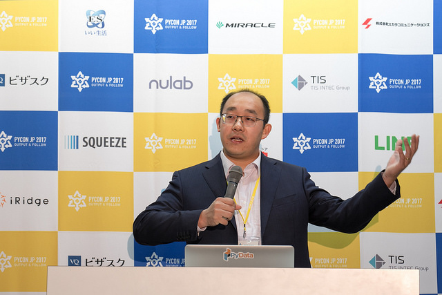
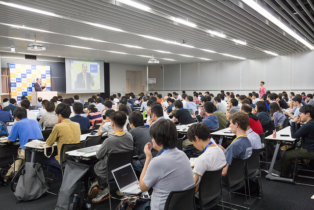
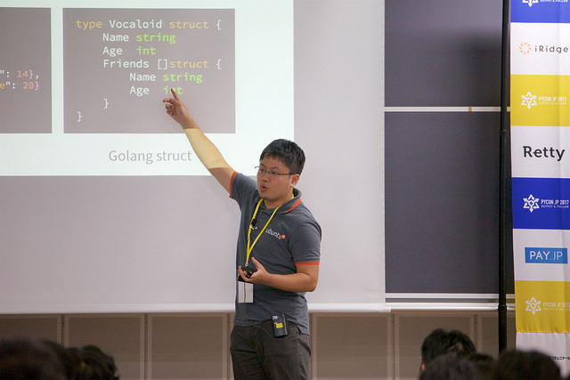

# PyCon JPとは

PyCon JPは，Pythonユーザが集まり，PythonやPythonを使ったソフトウェアについての情報を交換し，Pythonユーザが交流をするためのカンファレンスです。

PyCon JP 2017は2018年9月7日〜10日に早稲田大学西早稲田キャンパスで行われ、メインイベントとなる9月8日〜9日のカンファレンス来場者は約700人と大盛況でした。(9月10日のスプリントのみMicrosoft社で実施)
ご参加いただいた皆様，本当にありがとうございました。

ここでは2日間のカンファレンスのなかから、選りすぐりの注目セッションやイベントをレポートしていきます。

# 1日目基調講演「Python for Data: Past, Present, and Future」 ― Peter Wang
(陶山 嶺)

カンファレンス1日目の基調講演は、昨今非常に注目を浴びてきている「Python」と「Data」を題材にしたPeter Wang氏による講演でした。
Peter氏は、Numpy、Scipyの開発者であるTravis Oliphant氏とともにContinuum Analyticsを設立し、データサイエンス向けディストリビューションであるAnacondaを開発やPyDataカンファレンス、PyDataコミュニティを立ち上げてきた方です。

この講演は、Peter氏の自己紹介とともにContinuum Analyticsを設立した2012年から現在までのPythonやデータサイエンスをとりまく環境とその変化を振り返りながら始まりました。
2012年時点ではビッグデータに関するカンファレンスでもHadoopやJavaを利用したセッションが多かったようですが、現在ではPythonは[CM]()にまで登場するほどポピュラーな言語になっているとユーモアを交えて紹介されました。



さて、5年前とは打って変わって非常にポピュラーになったPythonですが、なぜデータサイエンス分野でPythonを使うべきなのでしょうか。
Peter氏が示したのは下記の2点でした。

* Pythonは教育用プログラミング言語であるABCをルーツとしているため、教育やプロトタイピングに向いている
* Pythonはソフトウェア開発からデータ分析まで広い領域をカバーしている

また、Peter氏は「Data science != Software Development」とも話していましたが
実際にPyCon JP 2017の参加者の中にもソフトウェア開発よりデータ分析がメインという方も多いようでした。
これは他のプログラミング言語のカンファレンスではあまりみないPythonの特徴のひとつですね。

Peter氏からは「What's Next?」と題したPythonの将来についての話もありました。
Peter氏は、「Apache Arrow formatにより言語間での相互運用性が高まる」、「メモリやストレージ、GPUの改善によってより多くのことがローカル環境で実行できるようになる」などの予測をしていました。

そして、講演の最後では、Pythonに関連するコミュニティについて言及し、その特徴を「Huge Maker Community」と表現しました。
これは、ScipyのようなPythonのメジャーで巨大なライブラリ群がソフトウェア開発者ではなく、ユーザー自身の手で作られていることを表した言葉ですが、端的にその特徴を捉えていると非常に感心させられました。

講演後には質疑応答がありましたが、こちらも活発に質問が飛び交いとても盛り上がりました。
キーノートの様子は質疑応答も含めて[こちら](https://www.youtube.com/watch?v=IaTDjOClhNA)で動画配信していますので、ぜひご覧ください。



### 資料リンク

* [動画](https://www.youtube.com/watch?v=IaTDjOClhNA)
* [スライド](https://www.slideshare.net/misterwang/python-for-data-past-present-future-pycon-jp-2017-keynote)


# 1日目注目セッション「ベンリに使おう変数アノテーション - typing.pyとの楽しいお付き合い」 - Takumi Sueda
(陶山 嶺)

Takumi Sueda氏による変数アノテーションをテーマにしたセッションを紹介します。
Sueda氏はFuller, Inc.に所属するエンジニアで、普段はPythonやGo言語を扱っており、この講演はGo言語にあるUnmarshalerという機能を、アノテーションを利用してPythonへ移植してみるという内容のセッションでした。

まずPythonのアノテーションの背景として、[PEP 3107](https://www.python.org/dev/peps/pep-3107/)、[PEP 484](https://www.python.org/dev/peps/pep-0484/)、[PEP 526](https://www.python.org/dev/peps/pep-0526/)の紹介がなされた後、移植したい機能であるGo言語のUnmarchalerについての説明がありました。
Sueda氏曰く、これは「PythonのjsonライブラリよりPythonic」だと感じる機能のようで、本セッションのモチベーションはこの点にあったようです。



そして、ここからは実際にPythonでbuiltin型、ジェネリック型、カスタムクラスを正しく区別し処理するunmarshalerを作成した過程をみていきます。

最初にアノテーションとして渡した情報が、ジェネリック型にどのように格納されているかを調べるところから始まりました。
まずはジェネリック型であるList[str]のmro()を呼び出し追っていきます。
すると、`typing.GenericMeta.__getitem__`が呼ばれ、そこからさらに自分自身のインスタンスを生成して返していました。
そしてその際に`self.__args__`へ渡された`str`を格納しています。
これはつまり、ジェネリック型の情報は__args__から取得できるということになります。

ちなみに筆者も手元で実際にやってみましたが、たしかに__args__で情報が取れていました！

```python
$ python3
Python 3.6.2 (default, Aug 11 2017, 16:57:55)
[GCC 4.2.1 Compatible Apple LLVM 8.1.0 (clang-802.0.42)] on darwin
Type "help", "copyright", "credits" or "license" for more information.
>>> from typing import List
>>> List[str].__args__
(<class 'str'>,)
>>> from typing import Optional
>>> Optional[str].__args__
(<class 'str'>, <class 'NoneType'>)
```

そして、ここからさらにbuiltin型、ジェネリック型、カスタムクラスを正しく区別する処理が紹介されました。
判別の方法はbuiltin型かどうかを判定、builtin型でなければジェネリック型かどうかを判定、ジェネリック型でもなければカスタムクラスかどうかを判定するという流れで作成したようです。

ここまでの一連の流れの説明をもってセッションは終了しました。
実際に実装したコードは[puhitaku/typedmarshal](https://github.com/puhitaku/typedmarshal)リポジトリにあるとのことです。

そして、このセッションの動画は[こちら](https://www.youtube.com/watch?v=q0rxk5vSzVI)にあります。
非常に内容の濃いセッションだったため、セッション動画を見ながら実際に手元で動かしてみることをおすすめします！

### 資料リンク

* [動画](https://www.youtube.com/watch?v=q0rxk5vSzVI)
* [スライド](https://speakerdeck.com/puhitaku/bian-li-nishi-oubian-shu-afalsetesiyon-typing-dot-py-tofalsele-siiofu-kihe-i)


# 1日目注目セッション「Pythonによる文章自動生成入門！Python ✖︎ 自然言語処理 ✖︎ ディープラーニング」 ― Hiromitsu Ota
(海老原 由夫樹)


# 1日目注目セッション「Pythonと機械学習によるWebセキュリティの自動化」 ― Isao Takaesu
(海老原 由夫樹)


# 1日目注目イベント メディア会議
(小林 正彦)

[メディア会議](https://pycon.jp/2017/ja/events/media-meeting/)は今年初めて行うイベントです。
編集者、著者の方々に登壇していただき、技術系書籍ができるまでの現場の生の声を届けてもらいました。

本イベントは、形式の異なる２つの企画による２部構成となっています。

* 第１部は「あなたとメディア、新たな出会い」です。テーマに沿って進行させていくパネルディスカッション形式の部です。
* 第２部は「登壇者とmeet up　本を書きたいあなたと握手」です。こちらは、１部とは趣を変えて、登壇者と直接会話できる場を設けました。

## 第１部　あなたとメディア、新たな出会い

ディスカッションテーマは３つ。

* 「売れる本」と「売れない本」の違いとは
* 本を書くためにすること
* 編集者と著者のマッチング

です。

[ここに写真]

最近の出版事情から、気になるけれどちょっと聞きにくいお金の話についてや、実際の執筆の場ではどのように作業をしているのかなどをお話いただきました。

### 登壇者

モデレーター
原 一浩(グレーティブ合同会社 代表)

スピーカー
緑川 敬紀(翔泳社 編集) / 高屋 卓也(技術評論社 編集) / 大津 雄一郎(リブロワークス 編集) / 岩崎 圭(スラスラわかるPython 著者) / 杉谷 弥月(いちばんやさしいPythonの教本 著者)

## 第２部　登壇者とmeet up　本を書きたいあなたと握手

第２部では、カフェテリアに場所を移し、登壇者と直接話せるmeet upを行いました。

[ここに写真]

一部の話を聞いて「自分も本を書いてみたくなった」、「こういう本を書きたいと思っているのだがどうしたらよいか」といった疑問や不安について相談してみようと、開催期間中は多くの方に足を運んでもらいました。

今回のイベントをきっかけに、新しい本や、著者が生まれることを楽しみにしています。


# 1日目ライトニングトーク
(小林 正彦)

PyCon JP 2017では、１日目、２日目ともにクロージングでライトニングトークを行いました。

今年のライトニングトークは両日とも8枠用意しました。
トーク希望者には会場に用意していあるトークボードに開催内容を記載していただきましたが、開場後すぐに用意した8枠が埋まってしまうほどの人気でした。

ここでは、カンファレンス1日目のクロージングに行われたライトニングトークから２つを紹介します。
なお、当日の発表者と発表内容の一覧、および動画のリンクを後述していますのでぜひご覧になってください。

## １つ目は、Miyazaki Yusuke氏による「Introducing wsgi_lineprof」です。

[ここに写真を挿入]

Miyazaki氏は、自身で作成したWEBアプリケーションのプロファイラ「wsgi_lineprof」についてのお話です。

まず、氏が参加されている[ISUCON](http://isucon.net/)についての紹介がありました。
ISUCONとは「お題となるWebサービスを決められたレギュレーションの中でどれだけ高速化することができるかを競い合うコンテスト」です。

サービスを高速化するためには、ボトルネックとなっている箇所を特定し、チューニングを行わなければなりません。
そのためにはプロファイラを使用します。
プロファイラはPython標準のものも含め数多くありますが、ISUCONのように短い時間の中で結果を出さなければならない状況では、
複雑な設定が必要になるようなものは使うのが難しいとのことです。

そういった課題をクリアするために、WSGIのミドルウェアとして「wsgi_lineprof」を作成されました。
本プロファイルはWSGIに対応しているアプリケーションやフレームワークを使用していれば動作が可能とのことです。

WEBアプリを作るのが好きな人。
そして、今よりも早く動かしたいと思っている人は紹介いただいたプロファイルをぜひ使ってみてください。

今後は、ISUCONでPythonを使って結果を残していきたいと意気込みを語っていました。

## ２つ目は、@nasa9084氏による「Dockerをローカルでドカドカ使う」の紹介です。

[ここに写真]

氏は、コンテナプラットフォームであるDockerについて、「具体的にどういったものをコンテナ化していくか」、
そして「そのメリットはどのようなものか」について話されました。

コンテナ化の対象として以下の4つを挙げられていました。
* 言語の実行環境のコンテナ化
* テスト環境のコンテナ化
* データベースのコンテナ化
* コマンドのコンテナ化

各ケースごとに具体的な実行例を示しながら、メリットとデメリットについて説明されました。

ローカルな環境でDockerを使うメリットとして、
「OSに依存しない環境を用意できる」、
「アプリケーションの配布が容易」、
「テスト実行ごとに初期化した環境を用意できる」、
などを挙げられていました。

Dockerは、アプリケーションやミドルウェア単位で利用することができるのも利点の一つです。
Dockerをよくわからないという人は、いきなりプロダクションレベルでの利用を目指す前に、
まずはローカル環境でVMのように使ってみてその便利さを実感して欲しいと話されていました。

### 1日目ライトニングトークの資料リンク

* ギャル語ほんやく : [PyLadies Tokyo hack-a-thon](https://pyladies-tokyo.connpass.com/)
* Introducing wsgi_lineprof : [Yusuke Miyazaki](https://github.com/ymyzk)
* Respect the Built-in Names : [Hayao Suzuki](https://twitter.com/cardinalxaro)
* 誰でも簡単に暗号通貨の取引Botを作れるようにしてみた : [Daiki Shiroi](https://twitter.com/catcat_festival)
* Pythonが動く仕組み : [Yoshiaki Shibutani](https://github.com/yotchang4s)
* OSS Friday : [Takuya Noguchi](https://twitter.com/tn961ir?lang=ja)
* Dockerをローカルでドカドカ使う : [@nasa9084](https://twitter.com/nasa9084)
* 多言語の歌詞の音声認識 : [@RenyuanLyu](https://twitter.com/renyuanlyu)

[PyCon JP 2017 クロージング動画](https://www.youtube.com/watch?v=cUewj2kRrbk&index=4&list=WL)


# 次回は？

1日目のカンファレンスレポート、いかがでしたでしょうか。PyCon JP 2017のカンファレンスは2日間で40を超えるセッションが開催されました。今回紹介できなかったセッションに下記のリンクから、ビデオや資料を見ることができますのでぜひご覧になってください。

[PyCon JP 2017 トーク一覧](https://pycon.jp/2017/ja/schedule/talks/list/)

次回、カンファレンス２日目のレポートもお楽しみに！
