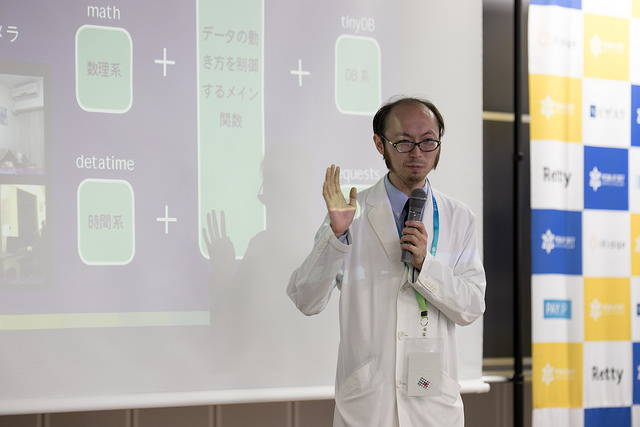
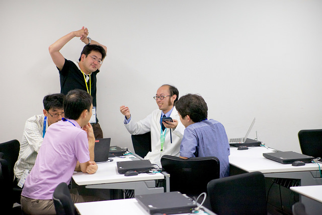
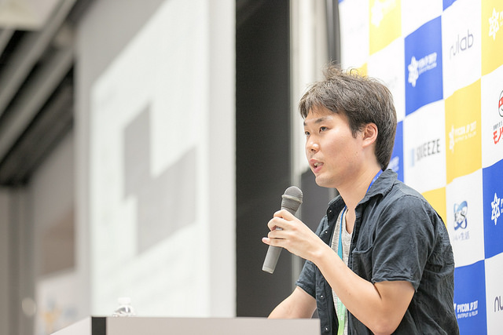
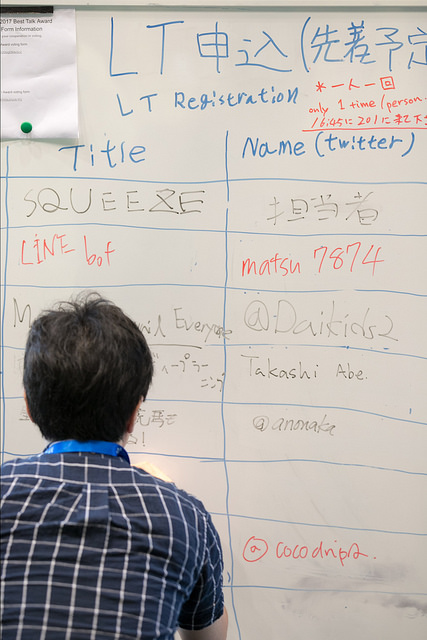
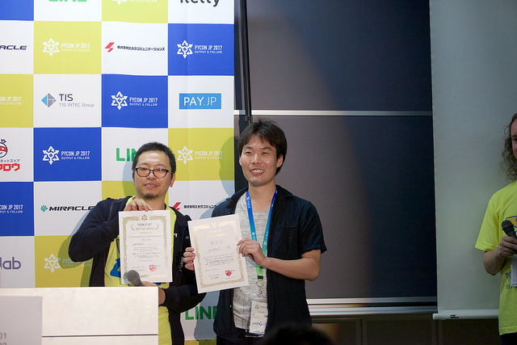
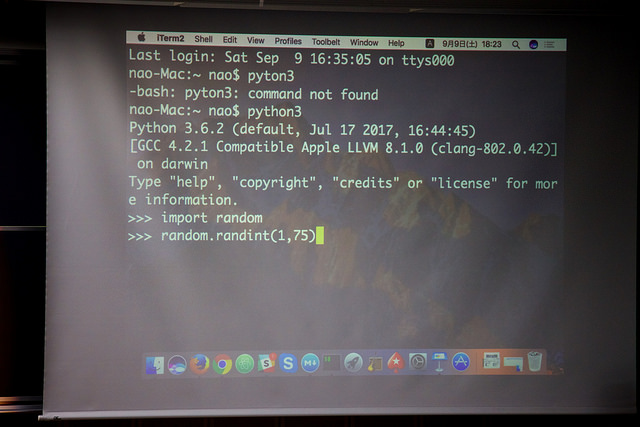

皆様、こんにちは。PyCon JP メディアチームです。先日公開した[カンファレンス1日目の記事]()はいかがでしたでしょうか？
本レポートでは引き続き２日目のKeynoteやカンファレンスなどの様子をご紹介します。
Youtubeへのリンクもありますので、ぜひご自宅や職場でカンファレンスの様子をご覧ください。

# 2日目基調講演「pandasでのOSS活動 事例と最初の一歩」 ― 堀越真映(Masaaki Horikoshi)
(小林 正彦)

2日目のKeynoteは、堀越真映さんによる「pandasでのOSS活動事例と最初の一歩」です。
堀越さんはPythonでデータ分析を行う際のパッケージとして有名なpandas、ならびに並列・分散処理するパッケージであるDaskのコア開発メンバーをつとめています。
また、自身でもPython, R, Rustでデータ分析のためのパッケージ開発を行っています。


講演では、科学計算分野におけるPythonの現状の紹介から始まり、自身がコア開発メンバーとして参加されているpandasのOSS活動について、そしてこれからどうやってOSS活動をしていけばよいか、といった話をされました

このプレゼンを通して、OSS活動に参加する際のハードルを下げられればとおっしゃっていました。

汎用的なプラグラミン言語であるPythonが科学計算で使われている3つの理由を紹介しています。

* 教育機関で使われている
* C/Fortranで書かれた資産の利用が容易である
* 科学計算系のOSSが発展・成熟してきている使われている金ねっは科学計算でも使われるようになっておきた。

成熟が進むことで、さらに教育機関で使われることが多くなる、といういいサイクルができている状態です。

Python問わず、データ処理系の言語がトレンドになっている。
なぜか？

* Pythonは教育用プログラミング言語であるABCをルーツとしているため、教育やプロトタイピングに向いている
* Pythonはソフトウェア開発からデータ分析まで広い領域をカバーしている

また、Peter氏は「Data science != Software Development」とおっしゃっていましたが、実際にPyCon JP 2017の参加者の中にもソフトウェア開発よりデータ分析がメインという方も多いようでした。
これは他のプログラミング言語のカンファレンスではあまりみないPythonの特徴のひとつですね。

Peter氏からは「What's Next?」と題したPythonの将来についての話もありました。
Peter氏は、「Apache Arrow formatにより言語間での相互運用性が高まる」、「メモリやストレージ、GPUの改善によってより多くのことがローカル環境で実行できるようになる」などの予測をしていました。

そして、講演の最後では、Pythonに関連するコミュニティについて言及し、その特徴を「Huge Maker Community」と表現しました。
これは、ScipyのようなPythonのメジャーで巨大なライブラリ群がソフトウェア開発者ではなく、ユーザー自身の手で作られていることを表した言葉ですが、端的にその特徴を捉えていると非常に感心させられました。

講演後には質疑応答がありましたが、こちらも活発に質問が飛び交いとても盛り上がりました。
Keynoteの様子は質疑応答も含めて[こちら](https://www.youtube.com/watch?v=1Cb3OQTmeD4&list=WL&index=2)で動画配信していますので、ぜひご覧ください。

### 資料リンク

* [動画](https://www.youtube.com/watch?v=1Cb3OQTmeD4&list=WL&index=2)
* [スライド](https://speakerdeck.com/sinhrks/pandasdefalseosshuo-dong-shi-li-tozui-chu-false-bu)

# 2日目注目セッション「Pythonの本気！RaspberryPiやEdisonを使ったIoTシステムの構築」 - 北神雄太
(山口 祐子)

みなさん興味津々のIoTネタということで、北神雄太さんによる講演をご紹介します。北神さんは高校時代からハードウェアに手を出し、現在はハードウェアとソフトウェアの両方の知識を生かしご活躍されています。最近では[Intel Edisonマスターブック](http://gihyo.jp/book/2017/978-4-7741-8921-5)という本を出版されました。  

北神さんがIoTに精通しているということで、おそらく会場の皆さんは「IoTでこんなことができました」系のトークを期待されていたと思います。しかし北神さんは「できました系の話はつまらない。私はなぜそれができたかの話をします」というかっこいい発言で会場を沸かせていました。  



「IoT時代においてPythonは最強」という主張をした北神さん。Pythonはハードウェアが扱えるということがその理由だそうです。  

ではなぜPythonはハードウェアが扱えるのか？Pythonにはハードウェアのライブラリがあるというのがその理由ですが、そのライブラリはC言語のラッパーとして作成されています。C言語では例えばレジスタへアクセスできるため、GPIOなどのハードウェアを動かすという芸当ができるということなのです。  

そうなると、IoT領域においては低レイヤーのC言語がベストなのではという疑問が当然出てきます。それに対して北神さんは、「そんなC言語をラップできるPythonこそ最強」と答えます。つまり、低レイヤーにアクセスできるC言語に、多様なライブラリを要するPythonが合わさることで、実に様々なことが実現できるのです。例えば温湿度センサーの機能を使ってデータを取得しそれをDBに格納、サーバでデータを表示、そしてネットワークにも繋げるということも可能です。  

```
<iframe src="//www.slideshare.net/slideshow/embed_code/key/noOWzVT0B9dlgZ?startSlide=26" width="595" height="485" frameborder="0" marginwidth="0" marginheight="0" scrolling="no" style="border:1px solid #CCC; border-width:1px; margin-bottom:5px; max-width: 100%;" allowfullscreen> </iframe> <div style="margin-bottom:5px"> <strong> <a href="//www.slideshare.net/yutakitagami/pycon-jp-2017yuta-kitagami" title="PyCon JP 2017Yuta Kitagami" target="_blank">PyCon JP 2017Yuta Kitagami</a> </strong> from <strong><a href="//www.slideshare.net/yutakitagami" target="_blank">Yuta Kitagami</a></strong> </div>  
```

トークでは、北神さん自作の自宅の温湿度モニタリングシステムを披露していました。  

軽快なトークで会場を沸かせた北神さん。講演の時間だけでは足りず、終了後も場所を変えて参加者とIoT話に花を咲かせていたようです。  



### 資料リンク

* [動画](https://www.youtube.com/watch?v=EQtcsJq-l98)
* [スライド](https://www.slideshare.net/yutakitagami/pycon-jp-2017yuta-kitagami/1)
* [トゥギャッターまとめ](https://togetter.com/li/1148920)


# 2日目注目セッション「SREエンジニアがJupyter＋BigQueryでデータ分析基盤をDev＆Opsする話」 - yuzutas0
(山口 祐子)

株式会社リクルートテクノロジーズでグループのIT施策全般を担当されているyuzutas0さんの講演を紹介します。プロダクト開発におけるデータ活用の一事例として、組織が抱えていた問題、そしてそれを解決するための取り組みをお話くださいました。  



yuzutas0さんが担当されているゼクシィ縁結びやゼクシィ恋結びでは事業が拡大しており、各部署にステークホルダーが多く存在していました。yuzutas0さんのチームではステークホルダーへ多種多様なデータを提供しており、それらのデータを活用するためにはデータ自動化・可視化が不可欠と感じていました。というのは、各部署によって必要なデータ、データ形式、データ疎通環境が異なるという混沌とした状況になっており、それに伴い調査コストなどのエンジニアチームの負荷が増加していたからです。  

そういった事情からデータ基盤システムを作ることになりましたが、設計にあたって2つのことを意識したそうです。  
一つ目は「ModelとViewを分ける」こと。部署や職種によって必要とされるViewは異なります。Excel,Tableau,Re:dash,Jupyterなど、多様なViewに対応できるようにしています。  

```
<script async class="speakerdeck-embed" data-slide="56" data-id="d520b273412b44bbb1b503e5a3ce83d5" data-ratio="1.77777777777778" src="//speakerdeck.com/assets/embed.js"></script>  
```

二つ目は「なるべくラクしてつくる」こと。世の中には便利なツールが多くあり、全て自分たちで作る必要はありません。アプリ層においては「Python」を採用しました。汎用的なプログラム処理を書くことができたり、データ分析関連のライブラリやツールが充実していたことがその理由です。また、インフラ（データ保存）に関してはBigQueryを採用しました。安い、早い、安心の三拍子揃ったシステムということで、インフラはGoogleに任せる判断をしたそうです。  

```
<script async class="speakerdeck-embed" data-slide="68" data-id="d520b273412b44bbb1b503e5a3ce83d5" data-ratio="1.77777777777778" src="//speakerdeck.com/assets/embed.js"></script>  
```

そのほかにもデータフローを回す上での工夫や、開発プロセスをトライアンドエラーで整備していったお話など、参考になる知見がたくさんありました。  

そして最後に、データ文化を組織に定着させることの重要性を主張しました。今までは、各ステークホルダーが協力することができず、データ活用が十分にできない状況にありました。（例えばビジネス側では各種データをExcelで扱っていたため、エンジニアからは手を出しづらかった、など。）その状況を「テクノロジー」と「文化・プロセス」で解決しようとしたのが今回ご紹介してきた取り組みです。  

```
<script async class="speakerdeck-embed" data-slide="129" data-id="d520b273412b44bbb1b503e5a3ce83d5" data-ratio="1.77777777777778" src="//speakerdeck.com/assets/embed.js"></script>  
```

現状ではまだ理想状態にはないということで、今後も試行錯誤して「データ活用がされる組織」を目指したいということでした。  

ちなみに詳細は後述しますが、このyuzutas0さんの講演は、PyCon JP 2017の「ベストトークアワード」の優秀賞に見事輝きました！組織におけるデータ活用やその運用方法について、やはりみなさん興味を持たれているのだなと実感する投票結果となりました。  

### 資料リンク

* [動画](https://www.youtube.com/watch?v=MR09Jb9cf9A)
* [スライド](https://speakerdeck.com/yuzutas0/20170909)
* [トゥギャッターまとめ](https://togetter.com/li/1148968)

# 2日目ライトニングトーク
(山口 祐子)

さて、PyCon JPでは毎回恒例のLT(Lightning Talk)があります。プログラムに組み込まれている通常のトークは事前先行がありますが、LTに関しては各日先着順で申し込むことができます。  



2日目のLTは全部で8つ。競馬でのデータ分析やPythonの設計思想の話など興味深い話が多い中、ここでは2つピックアップしてご紹介したいと思います。  

まずはmomijiameさんによる「Re: Respect the Built-in Names」です。  

```
<script async class="speakerdeck-embed" data-id="30b883607cf94ce18f56db80f8e4a0d7" data-ratio="1.33333333333333" src="//speakerdeck.com/assets/embed.js"></script>  
```

前日のLT「[Re: Respect the Built-in Names](https://speakerdeck.com/hayaosuzuki/respect-the-built-in-names)」（内容：ビルトイン関数への人権侵害はやめよう！）を聞いたのをきっかけに、このLTを思いついたそうです。※この「人権侵害」というのは、ビルトイン関数（strやmaxなど）へうっかり代入をしてしまう、あるあるネタのことです（詳細は[スライド](https://speakerdeck.com/hayaosuzuki/respect-the-built-in-names)参照。）このあるあるを撲滅するために静的コード解析ツールを活用しようということで、今回はPylintを紹介してくれました。Pythonコーディング規約のPEP8によると、このような人権侵害を回避する例として\_（アンダースコア）を利用すると良いそうですよ！  

続いてmatsu7874さんによる「PyCon JPで彼女作ってみた。」です。  
[スライド: PyCon JPで彼女作ってみた。](https://slideship.com/users/@matsu7874/presentations/2017/09/43ha6mtJX4Z8mfGVBD6oD5/)  
現在彼女がいないmatsu7874さんが、自らの技術力を駆使して彼女を作ってしまおうという（ネタ）企画です！Project KNJと命名されたこの企画では、twitterの過去のツイートを形態素解析(janome)し、マルコフ連鎖で短文生成(2-gram)、LINEアプリでおしゃべり(LINE Messaging API)させてしまおうという計画のもと進められました。一通り出来上がった後にKNJと対話を試みようとしましたが、意味不明の文章が帰ってきてしまい、まだまだ彼女をゲットするには程遠いという状況だったそうです。これにめげずに、頑張って理想のKNJを作り上げてくださいね！  

### 資料リンク

* [動画](https://www.youtube.com/watch?v=VgppotZZdWs)
* [トゥギャッターまとめ](https://togetter.com/li/1149071)


# クロージング
(山口 祐子)

LTの熱気冷めやらぬ中、クロージングも多くの方にご参加いただきました。翌日に開催されるスプリントの紹介やスプリントリーダーの挨拶に続き、座長の吉田から挨拶をさせていただきました。今回のPyCon JPではなんと690人以上の方にご参加いただいたそうです。  

そして今回初めて実施された「ベストトークアワード」。参加者から評価の高いトークを表彰したいという思いで今回企画されました。優秀賞はGraham Dumpletonさんの「[Secrets of a WSGI master](https://pycon.jp/2017/ja/schedule/presentation/9/)」、yuzutas0さんの「[SREエンジニアがJupyter＋BigQueryでデータ分析基盤をDev＆Opsする話](https://pycon.jp/2017/ja/schedule/presentation/38/)」、そして最優秀賞はGreg Priceさんの「[Clearer Code at Scale: Static Types at Zulip and Dropbox](https://pycon.jp/2017/ja/schedule/presentation/12/)」でした。残念ながら表彰式はyuzutas0さんのみとなりましたが、三者三様の興味深いトーク、とても素晴らしかったです！  



その後、今年のDiamondスポンサーであるSQUEEZEの関根氏や一般社団法人PyCon JP寺田氏の挨拶に加えて、恒例のプレゼントタイムということでビンゴ大会が執り行われました。Pythonカンファレンスらしくrandom関数で抽選をするという演出もありました。スポンサー企業の皆様、今年も素敵なプレゼントの数々ありがとうございました！  



そして最後に来年のPyCon JPについてのお知らせが発表されました。来年のカンファレンスは2018/09/17,18に[大田区産業プラザPiO](http://www.pio-ota.net/)で実施されます。ぜひ皆様、来年もお越しくださいね！  

さて「Output & Follow」をテーマに据えて実施された今年のPyCon JPでしたが、いかがでしたでしょうか？本連載でご紹介できた内容はPyCon JPのごくごく一部です。ネット上で今年のPyCon JPの振り返りブログが多く掲載されているので、是非是非皆様ご覧ください。それではまた来年お会いしましょう！  
