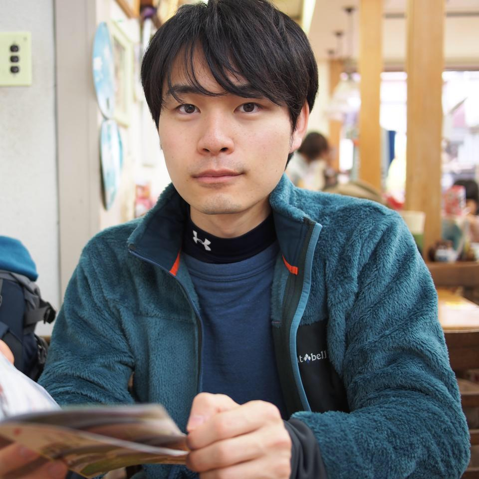

# 小林 正彦（こばやし まさひこ）

メディアスポンサー対応、PyCon JP 2017 メディア会議企画担当。
PyCon JPにはPyCon JP 2017にスタッフとして初参加。
株式会社アークシステム所属。SEサービスに従事。
企業システムの開発から運用までITのライフサイクル全般にわたるソリューションを提供している。
開発、運用業務効率化のためにPythonを使用している。

Twitter: [@donadeno](https://twitter.com/donadeno)
