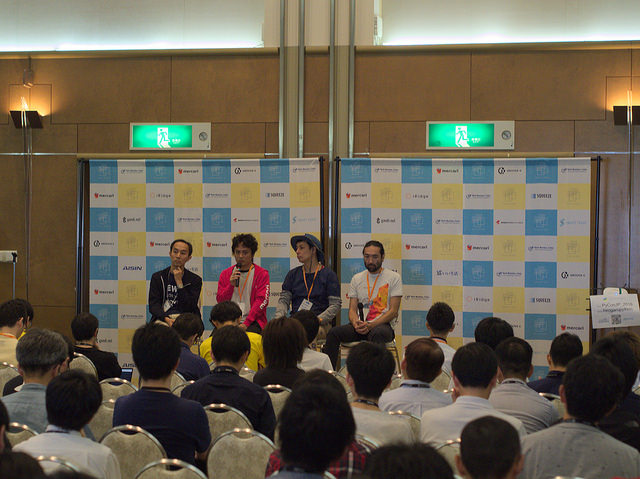
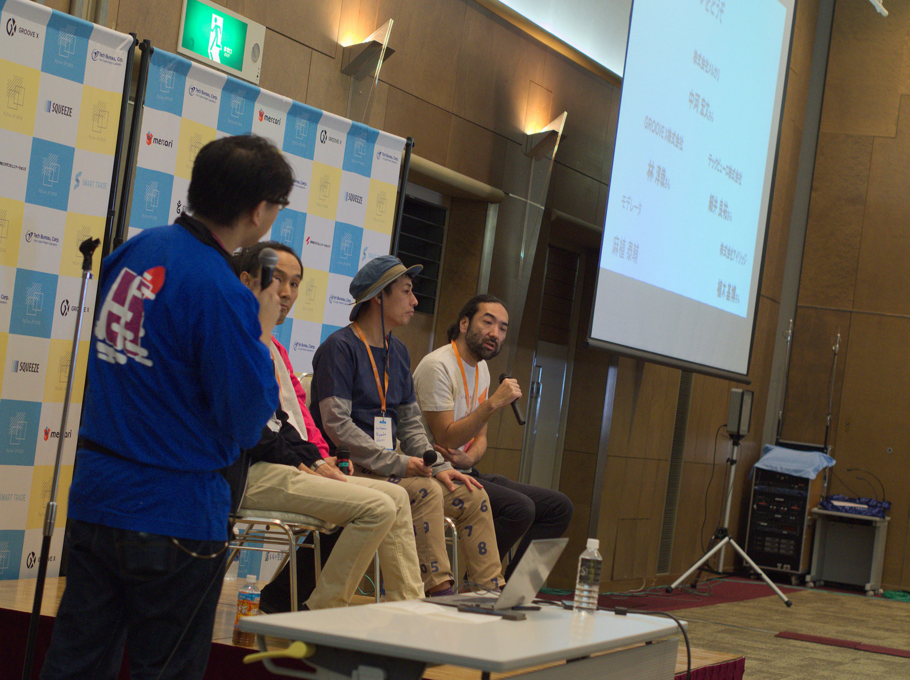
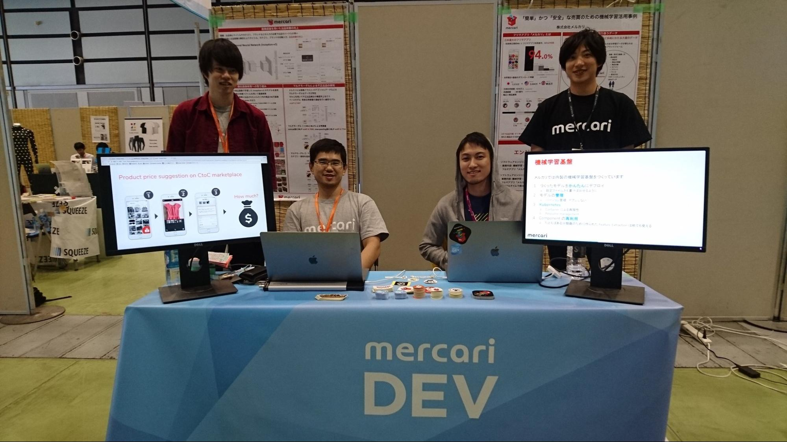
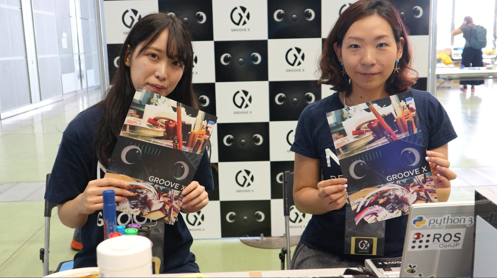
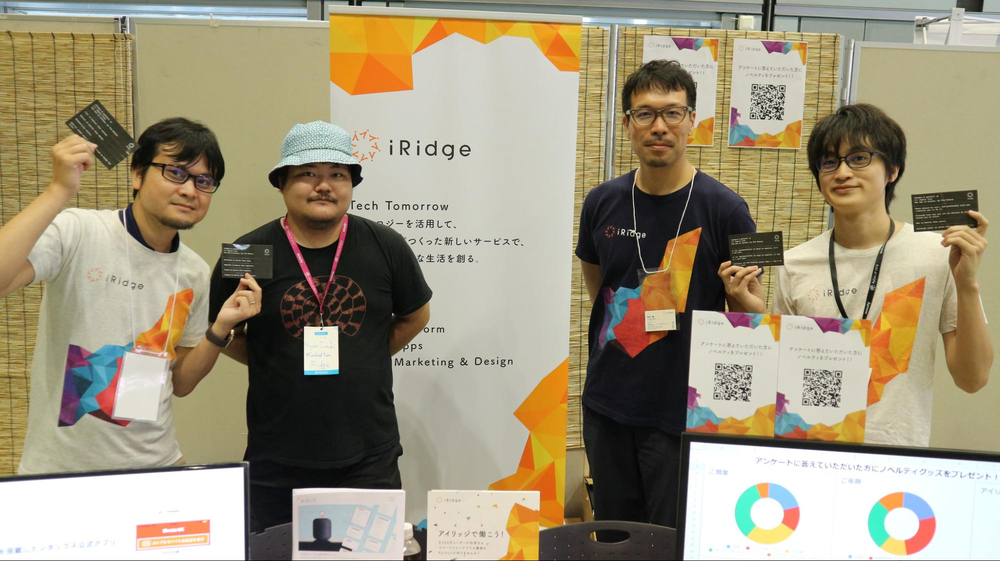
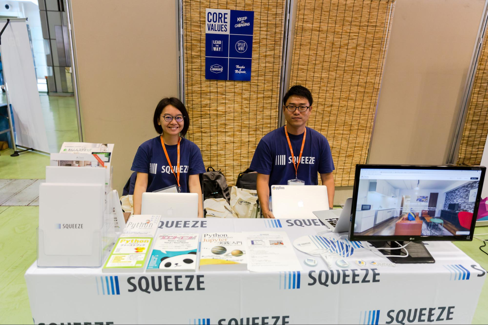
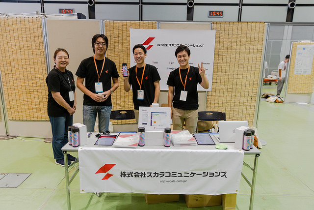

 # はじめに

　みなさんは「PyCon JP」というイベントをご存知でしょうか？　PyCon JPはPythonユーザーが集まり、Pythonや、Pythonを使ったソフトウェアについて情報交換、交流をするための国際カンファレンスです。国内では最大級のPythonイベントで、今年は4日間でのべ1156名が参加しました。

　今年の「PyCon JP 2018」は、9月15日（土）～18日（火）の4日間にわたって、株式会社HDEと大田区産業プラザPiOで開催されました（主催：一般社団法人 PyCon JP）。

　さて、そんなPyCon JPですが、毎年多くの参加者のみなさんに支えられて開催しています。来場者のみなさんからの参加費はもちろんですが、それに加えてPyCon JPの取り組みに賛同いただいている企業のみなさんにもスポンサーいただいています。そんな企業をご紹介するため、PyCon JPでは「ジョブフェア」というイベントを開催しています。ジョブフェアはPythonを用いてプロダクト開発をしている企業のみなさんが一堂に会し、その仕事や考え方の魅力を探っていくというイベントです。企業と個人がカジュアルに交流できる場として、みなさん色々と学ぶものがあったようです。

　さらに、会場ではスポンサー企業によるブースも開設しています。企業ブースでは、来場した皆さんとのコミュニケーションが活発に行われていました。

　本レポートでは、ジョブフェアの冒頭で実施したパネルディスカッションと、企業ブースでのインタビューの様子をご紹介したいと思います。

# ジョブフェア

　ジョブフェアは企業と個人がカジュアルな形で交流し、仕事などについて話ができる場を目指して毎年開催しています。今回は多種多様なスポンサー企業にお集まり頂いたため、パネルディスカッション形式で「企業内でPythonがどのように使われているのか」をざっくばらんに話して頂きました。

　プログラミング言語Scalaのカンファレンス「ScalaMatsuri」の座長である麻植泰輔氏をモデレーターに迎え、以下の方々が登壇しました。

テックビューロ株式会社 細井 良祐氏  
株式会社メルカリ 中河 宏文氏  
GROOVE X株式会社 林 淳哉氏  
株式会社アイリッジ 植木 基博氏

それでは、このジョブフェアの模様をダイジェストでお伝えしたいと思います。

## Pythonを使ったサービス開発

最初のテーマは「Pythonでどんなサービス・商品を開発していますか？」というテーマで、どんなプロダクトのどんなところでPythonを使っているかをお聞きしました。最初にお答え頂いたのは、大手企業のアプリのバックエンドで、O2O(Online to Offline)のサービスを提供している株式会社アイリッジの植木氏。

植木氏　東急線アプリとかGUとか、ファミリーマートとか、けっこう大手の企業のアプリの、モバイルバックエンド用サービスでPythonを活用しています。使い方としては一般的な構成だと思っていて、AWSのクラウド上にDjangoでアプリケーションを構築しています。ただ、スピードが求められるところは、最近はGo言語に書き直したりだとか、適材適所でいろいろ使っています。

麻植氏　なるほど。それらの企業のアプリがアイリッジのサービスを組み込むことで、どういうことができるようになるんですか？

植木氏　例えば東急さんの事例を紹介させて頂きますと、朝5時から7時の間に渋谷に行くと、ポイントが貰えます。一回でコーヒー一杯分貰えてけっこうお得なんですよ。そこの通知を送るときに位置情報を検出して、クーポンを送るだとか、位置情報を連携させることで色々なサービスを作れるっていうシステムを作っています。

---

次にお話をうかがったのは、フィンテック企業として、仮想通貨取引所であるZaifを開発しているテックビューロ株式会社の細井氏。元々個人開発していたプロダクトを買収し、それがPythonのフレームワークであるPyramidを利用していたことからPythonを利用するようになったそうです。

細井氏　テックビューロでは、仮想通貨取引所のZaifはほぼPythonで動いています。管理系のシステムでは一部PHPだとか、各仮想通貨の入出金ではnode.jsを使っています。置き換えられるところはなるべくPythonで書こうとしています。あとは社内では無いんですが、取引所のユーザーの方が自動売買するためのライブラリを整備し始めています。最近ホットな機械学習という分野は、社内では触れていないんですが、お客さんの中には活用されてる方もいらっしゃいますね。

麻植氏　今、自動売買のサービスを作ってらっしゃるところなんですか？

細井氏　いえ、あくまで取引所なので、テックビューロの中で自動売買を作るということはないんですね。取引所のAPIを提供していて、APIを使うためのライブラリだとか、あとはお客さんがボリンジャーバンドだとか一目均衡表とか、色々な統計情報を使って自動で売り買いできるようなライブラリを整備していこうとしています。

麻植氏　仮想通貨取引所のユースケースとして、自動売買のためにAPIを使うお客さんが入っているのは面白いですね。

---

GROOVE X株式会社では、ロボット開発で、デザイナーの立場のメンバーがPythonを使ったプロトタイピングを行なっているそうです。ペアプログラミングやモブプログラミングを導入して、エンジニア以外のメンバーも学びやすい環境を整えている等、組織づくりも工夫されていました。

林氏　うちの場合だとロボット開発なので少し特殊なんですが、主にPythonを使っているのはプロトタイピングと機械学習系のところですね。一つ特徴的だと思うのが、GROOVE Xには今ハードウェアの人とクリエイティブの人がいるんですけど、普段プログラミングしたことのないアニメーターさんとかデザイナーさんが、Pythonを使って、自分の手元でロボットを動かしたりしています。

麻植氏　へえ、面白いですね。その方は会社に入られてからPythonを勉強されたということですか？

林氏　そうですね。1年くらい前までは、そういう体制ができてなくて、アニメーターさんが動きを作ったらエンジニアが受け取って実装して、また見てもらってフィードバックしてというのを何度もやってたんですけど、そういうやり方だとすぐ一週間とか一ヶ月経っちゃうんで、今はロボットのSDKをなるべくシンプルで使いやすいように改善して、クリエイティブの人に「こうすると腕が動くよ」ってレクチャーして、アニメーターさんが自分でその場でやりたいようにロボットをプログラミングできる環境を用意しました。そうすることでより良いふるまいを早いイテレーションで作ることができるようになりました。

## プロダクトで使われている機械学習技術について

Pythonはソフトウェアの他に、機械学習の分野でも広く使われています。2つ目に「Pythonで機械学習していますか？」というテーマで、使用技術にフォーカスしてお聞きしました。まずは株式会社メルカリの中河氏にお聞きしました。

中河氏　弊社は外に公開している機能としては2つございます。まずは「感動出品」というもので、商品をアプリで写したときに、商品名やカテゴリ名を自動で補完してくれる機能です。もう一つがいわゆる「違反出品検知」と呼ばれるもので、例えば現金が出品されてないかとか、そういったものを検知して、マーケットをなるべく安全なものにしていくといった取り組みをしています。細かく分けるとこの2つの他にもあります。

麻植氏　「感動出品」の「感動」とは、出品者の体験として「感動する」ということですか？中河氏　そうです。「感動するUX」を提供するといった意味です。

麻植氏　良い標語ですね。ちなみに「感動出品」だと画像認識をされていると思うんですが、「違反出品検知」に関してはどのようにして検知しているんですか？

中河氏　「違反」と一口に言ってもいろんな種類がありまして、一つのモデルで全ての違反を検知することはなかなか難しいのですが、画像を使用しているものだったり、自然言語を使用しているものだったり、複数のモデルが動いている状況です。

植木氏　機械学習でサービスを作るとき、「これを出すか」ってリリースの判断はどうされていますか？WEBサービスであれば「機能Xが実現できればリリース」って判断できるのに対して、機械学習は例えば「違反出品がどれくらいの正答率になるか」は読めないんじゃないかって思うのですが。

中河氏　リリースと言いましても、いきなり100%のリリースをするわけでは無いんですね。Istioという、Kubernetesというコンテナオーケストラ層の中で、ルーティングを制御するような仕組みがあるんですね。それを使って、APIの段階開放だとか、A/Bテストをしようという取り組みを今行っています。

メルカリではこの他にも「ディープラーニングのアーキテクチャ自体を自動である程度生成してしまおう」といった試みなども行なっているそうです。最後に再び、GROOVE X株式会社の林さんに、「ロボット開発における機械学習」の話をお聞きしました。「機械学習を使って外界を認識できるのが最低条件」という話が印象的でした。

林氏　先ほどまで、サーバーサイドでの分析の話が多かったと思うんですが、うちの会社ではロボットの中で、センサーからの情報をリアルタイムに処理して、そこから意味のある情報を抽出するような話が多いです。もうちょっとわかりやすく言うと、画像認識とか、音声認識とか、そういったところで使っているのが1つです。もう一つは、家庭用ロボットを作っておりますので、一緒に生活していく中でだんだん成長していって欲しくって、その成長の部分の裏側の仕組みとして強化学習の考え方を取り入れています。

麻植氏　ロボットでそういった機械学習を使うというとついつい夢が広がっちゃうんですが、どういったユースケースが考えられるんですか？

林氏　ユースケースというか、機械学習を使っていることが前提になる状況でして、いくらカメラやマイクが付いていたとしても、それを正しくロボットが解釈できないと人から見ると全然「合ってない」行動を取ってしまうわけです。だから、ちゃんとセンサーの情報を解釈して外界を把握できるというのは最低条件みたいな形ですね。そこもなかなか難しいんですけど。

麻植氏　なるほど。「機械学習で最低条件を整える」までじゃなくて、「今後こうやりたい」って話はありますか？今お話できるレベルでもちろん構いません。

林氏　なかなか難しいんですが…。さきほど「外界をきちんと認識できなければいけない」と言ったんですけど、最終的なアウトプットはロボット自身の行動だったりするので。人間も周りのことをよく分かっているようで、分かってなかったりもするじゃないですか。そういうところも含めて、人々の生活にちゃんと溶け込めるようなロボットを作りたいなと思っています。

## まとめ

いかがだったでしょうか？紙面の都合でお伝えできなかった話も多いのですが、当日の雰囲気が少しでも伝わっていれば嬉しいです。

各企業とも、それぞれの分野でPythonを活用されている様子をお聞きすることができました。自分の仕事と共通してる話や、逆に知らない分野の話もあったかと思います。それを通して、どこかの企業に興味を持ったり、今後ご自身の仕事に役立てられる話を提供できていればと思います。

# 企業ブース紹介
## [株式会社メルカリ](https://about.mercari.com/)

最初に紹介するのは株式会社メルカリです。フリマアプリ内で使われている機械学習システムを中心に紹介されていました。

-- 今回の出展の目的はなんでしょう？

Pythonエンジニアにアピールするためです。メルカリはPHPの印象が強いのですが、マイクロサービス化によって他の言語も使われていて、例えば機械学習のシステムはPythonでできています。また、私達もTensorflowやscikit-learn等のOSSを利用しているため、Pythonの技術コミュニティが盛り上がると嬉しいという気持ちもあります。

-- 出展の推しポイントはどこですか？

「感動出品(機械学習を用いた出品情報自動入力)」の機械学習システムのポスターや、メルカリがKaggleで開催したコンペティションの紹介スライドを展示しています。Kaggleのスライドでは優勝チームの使った手法を中心に紹介しています。

-- 最後にPythonエンジニアに一言お願いします。

メルカリはC2C(Consumer to Consumer)という新しいマーケットで、累計出品数10億 × 累計ダウンロード数1億の大規模なデータを使った分析にチャレンジできるところが、他の会社に無い魅力だと思います。多様な大規模データで、新しいサービスを作りだしたい方は[採用情報ページ](https://careers.mercari.com/)からぜひご応募ください。

## [GROOVE X 株式会社](https://groove-x.com/)

昨年から引き続いてスポンサー参加して頂いたGROOVE X。「LOVE×ROBOT=LOVOT」というコンセプトで人に寄り添うロボットを開発中（2018年末発表予定）です。

 -- 今回の出展の目的はなんでしょう？

 まず、「商品発表前でまだ無名なので、会社自体を少しでも多くの人に知ってほしい」「素敵なエンジニアの方を採用したい」という2つが理由です。ロボット開発というとハードウェアの印象が強く、Pythonが使われるイメージは無いかもしれませんが、実際にはロボットを支えるクラウド上のアプリケーション開発なども必要です。その中で、実際に手を動かせる方であると嬉しいです。

 -- 出展の推しポイントはどこですか？

タスク管理するカンバンや、机の上の技術書など、私達が普段仕事している様子をほぼそのまま持ってきました。ミーティング中に食べるお菓子や、カンバンの似顔絵まで再現しています（笑）。

-- 最後にPythonエンジニアに一言お願いします。

こちらは本当に一言、「We are hiring!」でお願いします。

## [株式会社アイリッジ](https://iridge.jp/)

次はPyCon APAC 2013から、毎年PyCon JPに参加されている株式会社アイリッジです。位置連動型プッシュ通知ASP「popinfo」の開発を中心に各種サービスを展開しています。

 -- 今回の出展の目的はなんでしょう？

もちろんPythonエンジニアへのアピールのためです。アイリッジではDjangoを使った開発が多いので、特にWEB開発のエンジニアに来て頂けると嬉しいですね。

 -- 出展の推しポイントはどこですか？

Pythonエンジニアに向けたアンケートを行って、その結果をリアルタイムにグラフに反映させて展示しています。「去年と比べると、最初にPython3系から始めた人が増えてきているな」など分かって面白いんですよ。これに答えて頂けた方には「The Zen of Python」のステッカーを差し上げています。弊社はコーヒー好きな社員が多いので、アイリッジロゴが入ったコーヒーバッグも配ってます。

-- 最後にPythonエンジニアに一言お願いします。

東京タワーの近くで、Pythonの仕事がしたいエンジニアはぜひ遊びに来てください。

## [株式会社SQUEEZE](https://squeeze-inc.co.jp/)

PyCon JP 2015からスポンサー頂いています。宿泊事業者の運用管理のためのアプリケーション開発を行っている会社です。

-- 今回の出展の目的はなんでしょう？

会社のPRと採用のためです。SQUEEZEではSaasのサービスをDjangoで提供しているので、サーバーサイド・フロントエンドの開発のできる方に来ていただきたいと考えています。

-- 出展の推しポイントはどこですか？

まず、弊社のプロダクトを紹介しています。B向けの事業がメインのためあまり知られていないと思うのですが、宿泊事業者様へのSaasプロダクト、自社で運営しているスマートホテル「Minn」いう宿泊施設もあります。また、弊社のメンバーが執筆した本を紹介しています。実はカンファレンスでもメンバーが2人発表しています。

-- 最後にPythonエンジニアに一言お願いします。

PythonやDjangoで開発したい方は、もし興味がありましたらぜひ遊びに来てください。

## [Gandi.net](https://www.gandi.net/ja)

PyCOn JPは2014から毎年参加しているGandi.net。日本にオフィスはないそうで、はるばる台湾からのご来場です。

-- 今回の出展の目的はなんでしょう？
Gandi.netの日本でのユーザーを増やすことや.moeなど新TLDの認知度アップが目的です。ドメインレジストラなので、ターゲットは技術者になります。
私たちは、一切広告やメールによるマーケティングをしていません。その代わり、PyCon JPに限らず、海外のPyConやOSSのサポートを通じて利用者を広げていくという方針です。

-- 毎年参加されていますが、今年の推しポイントはなんでしょう？
昨年までは英語のページしかなかったのですが、今年はついに全面日本語対応しました。無料でドメイン登録できるプロモコードを配布していますのでぜひ使ってみてください。APIも公開していて、エンジニアフレンドリーな環境を提供しています。ギークな皆さんにどんどん使ってもらいたいです！

## [株式会社スカラコミュニケーションズ](https://scala-com.jp/)

 次は、昨年に引き続きGoldスポンサーをして頂いたスカラコミュニケーションズです。

-- 今回の出展の目的はなんでしょう？

もちろん技術への関心が高いエンジニアにアピールするためです。弊社は多数のサービスをBtoBで展開しているのですが、更に機械学習やIoTなどの最新分野を取り入れたサービスを展開したいと考えています。そのために、Pythonにも力を入れていきたいと考えています。

-- 出展の推しポイントはどこですか？

また、アンケートに答えて頂けた方に、The Zen of Pythonのステンレスボトルを差し上げています。こちらは去年好評だったマウスパッドの色違いのデザインになっています。

-- 最後にPythonエンジニアに一言お願いします。

弊社では新しいサービスを開発するための基盤があり、自分のやりたいことを実現できる環境は整っていると思います。やりたいことを実現したい人、もっと言うと「俺にサービスを作らせろ！」ってエンジニアは、ぜひ採用に応募してください。

## [株式会社SmartTrade](https://smarttrade.co.jp/)

こちらもPyCon JPへは初出展の株式会社SmartTrade。QuantXという投資アルゴリズムを無料で開発でき、さらにそれを売れるサービスを展開しています。

-- 今回初出展ですが、出展のきっかけと目的はなんでしょう？
[fin-py](https://fin-py.connpass.com/)ユーザーグループの方に紹介していただいたのがきっかけです。
今回は投資アルゴリズム開発ユーザーの募集と一緒にシステムを開発してくれるエンジニアの募集ができればと思い参加しました。

-- どんなサービスなのでしょう？
投資アルゴリズムの開発環境を無料で開放して、開発されたアルゴリズムの売買ができるマーケットの運営をしています。すでに作ったアルゴリズムの販売で100万円単位の売り上げを出した人もいます。

-- 最後に来場者の皆様へ一言お願いいたします。
我々の試みは日本にには他には無いもので、世界的にも珍しいチャレンジです。
一般人のエンジニアでも戦える環境を無料で提供することで、一部の人々に限られていた金融基盤を民主化し、利用者も開発者もハッピーになる世界を目指しています。技術の力で一緒に金融革命を起こしましょう！

## [アイシン精機株式会社](http://www.aisin.co.jp/)

PyCon JPへは初出展のアイシン精機株式会社。パーソナルモビリティ「ILY-Ai」（アイリー-エーアイ）の展示をしていました。

-- 今年が初出展ですが、出展のきっかけはなんでしょう？
昨年5月にお台場に人工知能に特化した研究センターを開所したので、一緒に働くメンバーを探しに来ました。
ILY-Aiは会社を知ってもらうきっかけになればと思って今回展示していますが、他の製品も主にPythonを使って開発しています。

-- ILY-AiではどんなところでPythonが使われているのでしょう？
障害物検知などを行なう技術に使っています。また、人の認知や判断を強化学習で実現させています。

-- 最後に来場者の皆様へ一言お願いいたします。
そもそもILY-Aiは高齢化社会におけるライフスタイルの変革を支援するために開発しています。
我々は「ラストワンマイル」と表現していますが、足が不自由だったり、道が悪かったりすると、外出する機会が少なくなって、近くの駅やコンビニに行くのもためらってしまうような現実があります。ILY-Aiでそうした不自由を取り払っていければと思っております。

Pythonで一緒に未来をつくりませんか？

## [株式会社いい生活](https://www.e-seikatsu.info/)

最後は、今年で3回目の出展になる株式会社いい生活。Pythonで不動産業界の変革を支援しています。

-- 昨年も参加されておりますが、反響はどうですか？

今年は2名社員がLTで登壇していますが、内1名は昨年のPyCon JPがきっかけでの入社です！

不動産業界向けの事業をしているので、一般にはあまり知られることはないのですが、スポンサードすることで知名度の向上にもなっています。

-- Pythonはどれくらい使われているのですか？

2012年ごろからPythonを使っていて、APIの開発を中心に利用しています。バージョンは2系も3系が共存状態になっていますが、機能的な見直しのタイミングで順次3系に移行しています。

技術スタックは様々ありますが、社内でどんどん新しいものに挑戦して、プロダクトに取り込んで行くというスタイルです。

-- 最後に来場者の皆様へ一言お願いいたします。

競技プログラミング経験者や、今年のISUCONでPythonを使って本戦出場を決めたエンジニアも在籍しています。がっつりPythonを使っていますので、クラウドサービスの基幹にかかわるサーバサイドに挑戦してみたいというエンジニアを募集してます。

