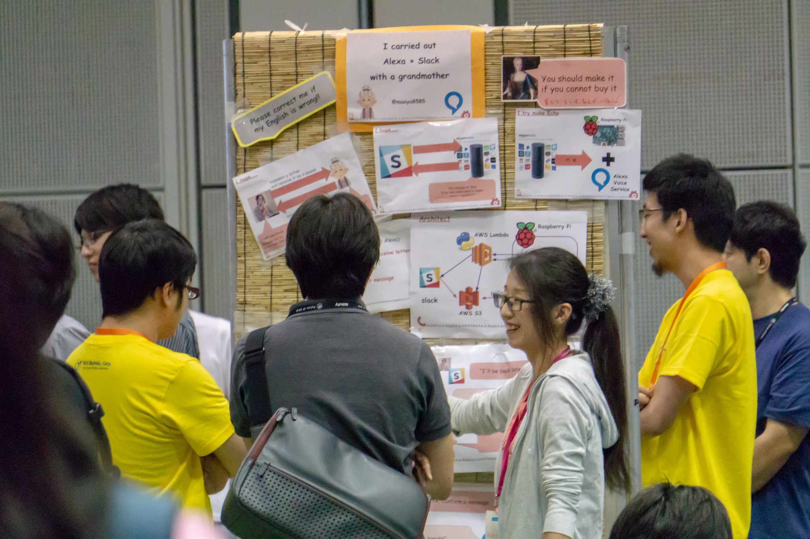
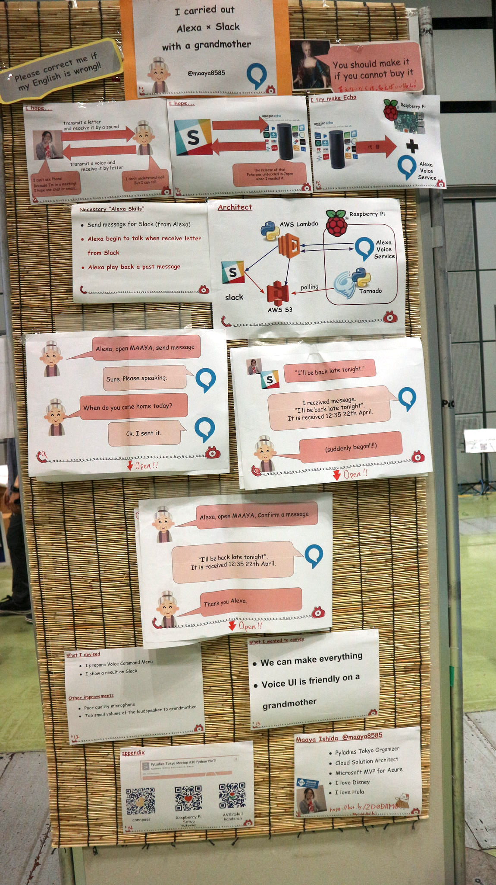

# 「興味を持ってくれた人と気軽にコミュニケーションが取れる」 - PyCon JP 2018発表者に訊くトークセッションにはないポスターセッションの魅力

　9月15日〜18日にかけてPyCon JP 2018が開催され、4日間で1000人を超す参加者の方々にご来場いただきました。
ほんとうにありがとうございました。

　PyCon JPでは毎年トークセッションのほかにポスターを使って発表を行うポスターセッションという企画を行なっています。
このポスターセッションは、通常トークセッションとはまた一味違った面白さや魅力があり、例年人気のある企画となっています。
そこで、PyCon JP 2018でポスターセッションで発表された数名の方々に、ご自身の発表内容やポスターセッションの魅力などをお話ししていただきました。

* ばーちゃんとAlexa × チャットを実現した話 - 発表者: まーや(Maaya)
* Python Boot Campで全国にPythonの環を広げよう！（2018年版） - 発表者: Ryuji Tsutsui
* Python x 金融のコミュニティ fin-pyの活動事例 - 発表者: driller

## ばーちゃんとAlexa × チャットを実現した話

-- まずは自己紹介からお願いします。

石田真彩（いしだまあや）と申します。普段はPyLadiesの2代目オーガナイザーをやっています。
仕事はクラウドソリューションアーキテクトなので、普段コードをゴリゴリに書いてるというわけではありません（笑）
クラウドはAzureをメインにAWS, GCP, Oracle Cloudを比較のために触っています。

-- ご自身のPyCon JPとの関わり方を教えてください。

ほとんどがPyLadies関係で、毎年何かしらポスターなりブースなりを出しています。あとは普通に参加者として楽しんでいます！
PyLadiesは今年4周年なんですが、実は4年前のPyCon JPのポスターセッションでまかび（注: PyLadies初代オーガナイザー）が「PyLadiesたてます！」っていうポスターセッションを行って、その翌月にミートアップ#1が行われたんですよ。
なのでPyCon JPのおかげでPyLadiesは発足したんです。

-- そうだったんですね。PyCon JPのポスターセッションとPyLadiesにそんな関係があったなんて初めて知りました！（笑）
それでは自己紹介はここら辺にして今回の発表内容について軽く説明をお願いします。

はい。タイトルは「ばーちゃんとAlexa × チャットを実現した話」です。
概要としては、文字でメールをしたくないおばぁちゃんとミーティングが多くチャットで連絡を取りたい自分が、お互いの要望を叶えつつ連絡をとるためのソリューションです。
おばぁちゃんがAlexaに向かってしゃべって連絡するとSlackでわたしのもとにメッセージが届きます。
わたしはSlackのとあるチャンネルに文字を入力すると、カタコトの音声でAlexaがしゃべります。
これを作ったときのアーキテクチャの話です。

-- Alexaがしゃべるんですね。

Alexaと言っているんですが、実際はAlexaにプッシュ機能がないためラズベリーパイの中にAlexaのキットを入れて、しゃべる部分はAquesTalkPiを使ってしゃべらせています。
なので、半分Alexa、半分自作でそれを一緒のラズベリーパイにいれたので１つのAlexaっぽくなっているという感じです。

-- なるほど。Alexaにはプッシュ機能がないんですね。

はい。ラズベリーパイの中に音声を文字に変える処理が入っています。そこからAWS Lambdaを使ってその文字をSlackに送っています。
逆にSlackで文字を打ったら、それをS3にあげておくんですね。それをラズベリーパイの中のtornadoでポーリングしています。
あと、一回しか喋らないと聞き逃したりしてしまうので「新しいメッセージある？」と聞くと最新のメッセージを読み上げてくれます。
なので、しゃべった音を文字化する、文字を音声化する、メッセージ確認の3つの機能がついたAlexaもどきを作りました。

-- Alexa自体はつかってないんですね（笑）

はい。Alexaの機械自体は全く使ってないというか実は買えなかったんです（笑）
これを作った時はまだ抽選販売の期間で全然買えなかったんです。
ただ、プッシュ機能がそもそもAlexaにはないので機械があってもどっちにしろラズベリーパイを使わざるを得なかったです。

-- そんな裏側があったんですね。今回一番工夫した点はどこでしょうか？

技術的には自分の持っているものでできたんですが、「いかに祖母に使ってもらうか」「使いやすくするにはどうすればいいか」を一番工夫しました。特にボイスUIはこだわりましたね。
例えば、スキル名を自分の名前のまぁやにして、「あれkすあ、まぁやにメッセージを送って」と孫の名前を呼ばせるようにしました。
また、「こういうことしたいときはこう話しかけてね」っていうポップをラズベリーパイにポップをつけたりしました。
あとは、一緒にパソコンの画面を見せたり、家のなかでちょっとだけ離れて触ってもらったりしました。

-- いろんな工夫をして楽しく作ったんですね。あと、今回のポスターセッションでまぁやさんが一番伝えたかったことは何でしょうか？

いまは技術が発展しているので自分が欲しいものは結構作れる、意外とボイス系のシステムはご年配の方や子供でも使いやすいと思うので発展してほしい、自分も貢献したいと思って発表しました。

-- なるほど。たしかにボイスUIは親しみやすいUIですよね。ここまで発表内容についていろいろお話いただいたので、最後にポスターセッションの魅力を教えてください。

ずっと貼りっぱなしにできるので発表していない時も見てもらえるのはリーチが届く範囲が大きいと思います。
あまり難しいことはしていないので、これを見て自分でもやってみようと思ってもらいたかったです。
あと、この人はAWSを知らないから詳しく話してあげようみたいに調節しながら話せるのもいいところです。

-- ポスターセッションにはそういった魅力があるんですね。石田さん、ありがとうございました。
とても温かみのあるお話が聞けて面白かったです。

