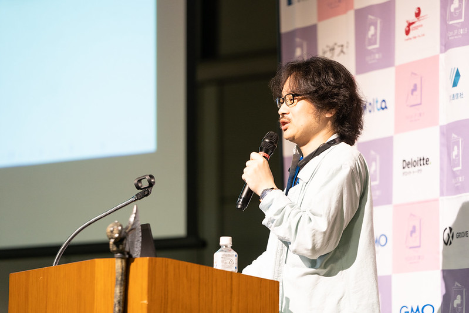
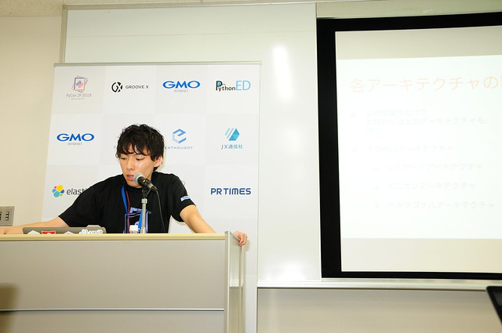
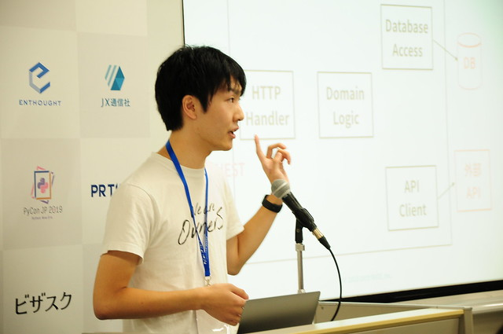
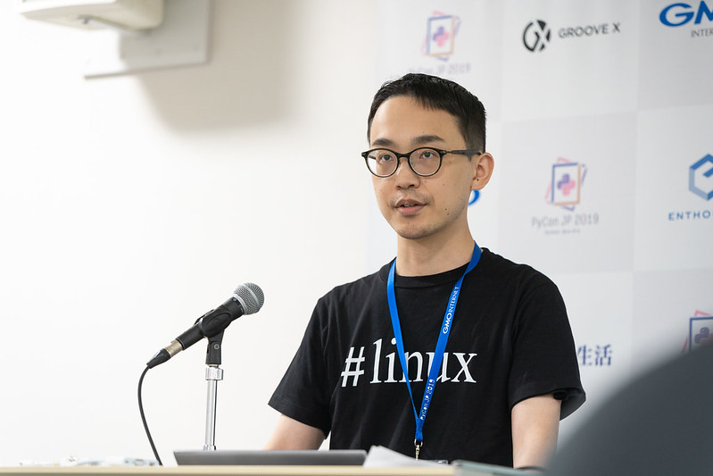
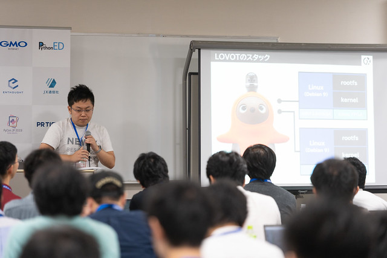
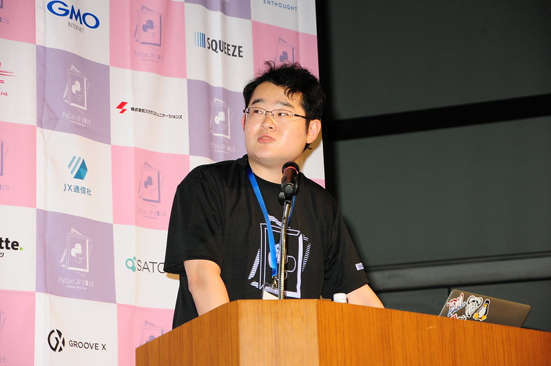
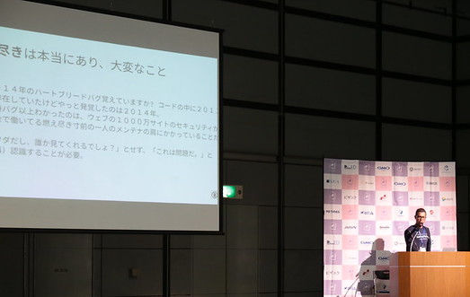

# PyCon JPとは

PyCon JPは日本国内外のPythonユーザーが一堂に会し、互いに交流を深め、知識を分け合い、新たな可能性を見つけられる場所として毎年9月中旬に開催される国際カンファレンスです。

PyCon JP 2019は2019年9月14日のスプリント（HENNGE株式会社）、9月15日のチュートリアル、9月16日〜17日のカンファレンス(大田区産業プラザPiO)と4日間の会期で開催されました。来場者は4日間で約1160人と昨年を上回る大盛況で、Pythonへの注目が年々増していることがわかります。

今回は16日に行われたカンファレンスの中から、注目セッションやイベントの様子と感想について運営スタッフがレポートします。

## 基調講演「Why Python is Eating the World」 ― Cory Althoff

(牛窪翔)

1日目の基調講演は、Cory Althoff氏による講演でした。

Cory氏は政治学の学位を取得後にソフトウェア開発の世界に飛び込み、独学でプログラミングを学んだ後ソフトウェアエンジニアとして働きました。
彼自身の経験を基にした著書、[The Self-Taught Programmer](https://www.theselftaughtprogrammer.io/optin)でも有名です。

Cory氏はかつて別の言語でのプログラミングをし挫折した経験があります。再びプログラミングをしたいと思ったときにPythonを知り、そこからPythonの世界にのめり込みます。
独学の後、フリーランスのプログラマーとして仕事をするようになり、ソフトウェアエンジニアとして活躍。その後シリコンバレーのスタートアップにて自分にとって最高の環境で仕事をするまでになりました。

これまでのキャリアから、何もない状態からここまで自分を高めてくれたPythonに対して恩返しをしたい、他の人にも伝えたいという気持ちが芽生え、今ではPyConはじめ様々なコミュニティで活動を行っています。

Cory氏は本セッションのテーマとして、「なぜPythonが世界を席巻しているのか」を説明していました。
その理由として

1. 初学者への導入が素晴らしい
2. 企業側の需要が高まっている
3. 素晴らしいコミュニティが多い

の3つあげています。

1つ目の理由はPythonが初学者にとってわかりやすく、色々なエンジニアリングのパスが用意されていることを他言語と比較をしつつ説明していました。

2つ目の理由は、Pythonが国内外問わず他言語に比べて急成長しており、企業側の需要が高まっていることを説明していました。

3つ目の理由は、Pythonに関わるエバンジェリストや様々な素晴らしいコミュニティを紹介していました。

発表の中ではさまざまなデータやエバンジェリスト・コミュニティの紹介もしていました。

セッション動画にて，当日の会場の皆様を席巻するようなCory氏の登壇の様子を是非御覧ください！


### 資料リンク

* [動画](https://www.youtube.com/watch?v=Bcxz-jXMLZk)

## ビギナーセッション 「Python開発を円滑に進めるためのツール設定」- Atsushi Odagiri

(横山直敬)

Atsushi Odagiri氏によるビギナーセッション「Python開発を円滑に進めるためのツール設定」をレポートします。

ビギナーセッションとは、Pythonの初心者が次のステップに踏み出すきっかけづくりを目的としたセッションです。

「Python開発を円滑に進める」と聞いてどのようなイメージを持つでしょうか？Odagiri氏は「Python開発を円滑に進める」とはつまらないミスを減らすことにあると言います。
ツールは開発速度ではなく品質を上げる目的で使われます。ツールを実行するだけで今まで60%だった品質が80%にまで上がることもあるのです。

Python開発を支えるツールには大きく分けて3つの種類があります。

1. linterツール: コーディング規約に沿ったコードになっているかチェックする

    - 例. flake8, black

2. 型アノテーションツール: Pythonは動的型付け言語ですが、型アノテーションツールを使うことで変数や戻り値に想定外の型のデータが使われていないかチェックする

    - 例. mypy

3. テストツール: ユニットテストを実行する（複数のPythonバージョンを指定できるツールもある。）

    - 例. pytest, tox
    

ビギナーセッションでは以下のツールの使い方・おすすめの設定が解説されました。

- flake8

- black

- mypy

- pytest

- tox

各ツールの使い方・設定の詳細についてはセッションの動画をご覧ください。

ツールはCI時に実行したり、Gitのpre-commitに設定してコミット前に実行することもできますが、最も望ましいのはエディタ上で自動実行することです。
そうすることでコードの編集や保存時にツールからの警告が出たり、コードのフォーマットが自動に行われるように設定することができます。
エディタ上で自動実行されることの利点はツールからの警告をすぐにコードに反映できることにあります。
Visual Studio Code, emacs, vim, PyCharmといった主なエディタはツールの自動実行に対応しています。

特に設定しておくと良いのは、以下の3つです。

- 編集中のlinterツール(flake8やmypy)の警告を出す

- コードの保存と同時にblackでフォーマッティング

- テスト実行結果からエラー箇所へのジャンプ

退屈なこと(コーディング規約や型アノテーションのチェック)は機械(ツール)に任せることで、よりプログラムの本質に迫ったレビューや議論ができるようになります。その結果として開発全体が効率化されます。
最後にOdagiri氏は、豊富なアドオンがあるテストツールpytestについて各自のプロジェクトに導入できそうなアドオンを調べてCIに導入してみることを提案しました。



- [動画](https://www.youtube.com/watch?v=1FcLwOpXuAI)

- [スライド](https://www.slideshare.net/aodag/python-172432039) 

## 注目セッション「Djangoで実践ドメイン駆動設計による実装」 ー 大島和輝

(牛窪翔)

株式会社パソナ JOB HUB 所属の大島和輝氏は[Django Congress JP 2019](https://djangocongress.jp/)のスタッフとしても活動した経験があり、Djangoに関するコミュニティに所属しつつ、精力的にアウトプットしている方です。

セッションではドメイン駆動開発 (以下DDD) をDjangoでどう実装していくかの指針を紹介していました。

背景としては、複雑化してきたアプリケーションの開発で、ドメイン駆動設計の手法を一部取り入れた例が最近出てきました。

アプリケーションの規模が増していくにつれて、MVCモデルでの実装を続けていると、肥大化したModelやControllerが作られやすく、その解決策の一つとしてDDDの手法などが話題になっています。

そこで、本セッションではDjangoでドメイン駆動開発(以下 DDD)を設計する際のやり方をDDDの用語を交えながら説明していました。

当日の説明にてまず最初に、DDD及びドメインとは何か、戦略的設計と戦術的設計の違い、MVCの問題点を紹介していました。

続いて、DDDの一手法であるクリーンアーキテクチャの説明とDjangoの説明をしました。

最後に、Djangoのアプリケーション単位をサブドメインとしながら、DDDの

* ファクトリ

* ドメインサービス

* アプリケーションサービス

* エンティティ

* バリューオブジェクト

* リポジトリ

を中心にどのように実際に設計するのかソースコードを参照しながら紹介していました。

発表の中ではソースコードを参照しながら設計されています。セッション動画も是非御覧ください。



### 資料リンク

* [動画](https://www.youtube.com/watch?v=9-OIHTJdDew&t=530s)

# 1日目注目セッション「Pythonを使ったAPIサーバー開発を始める際に整備したCIとテスト機構」 ー Higashiguchi Kazuki

(牛窪翔)

Higashiguchi氏による「Pythonを使ったAPIサーバー開発を始める際に整備したCIとテスト機構」のセッションを紹介します。

Higashiguchi氏は、Pythonアプリケーションを開発し始める際のCIでのコード検査とユニットテストの整備について紹介していました。

CIとは、Continuous Integrationの略で、継続的インテグレーションを指します。

CIでは、プロダクトのコード変更の度に、自動化されたビルドとテストを実行するもので、小さなサイクルでインテグレーションを繰り返し、エラー含む問題を早期に発見し、開発の効率化及び省力化を図る手法です。

セッションのはじめには、CIとは何かとそのメリットについて説明しました。

続いて、DB・外部APIへ依存するAPIサービスを題材として、CIツールの一つであるCircleCIを用いてPythonのコードスタイルチェック、ドキュメントスタイルチェック、静的解析チェックを実施する方法を紹介しました。

コードスタイルチェックでは「pycodestyle」を、ドキュメントスタイルチェックでは「pydocstyle」を、静的解析では「mypy」を主に説明しました。

最後に、CircleCIを用いてテストコードを作成・実行するためのテスティングツールの紹介をしながら、DB・外部API等の外部環境からどう隔離しつつ自動テストを実行させるのか、様々なツールやライブラリを説明しつつ使いながら紹介しました。

近年、CIを導入して開発している企業が増えているなか、まだまだ導入に踏み切れていない企業もありますし、個人の学習では導入していない方も多いのではないでしょうか。

本セッションで実際に導入する際のツールとやり方を紹介しつつ、そのメリットをわかりやすく説明されていたため、CI導入をしてみよう！と思う参加者の方も多かったのではないかと私自身思いました。

実際のツールの紹介やCircleCIのコード例はセッション動画を、外部環境からの隔離だけではなく、依存関係の差し替え可能なコード設計の方法がリンクの資料にありますので是非御覧ください。



### 資料リンク

* [動画](https://www.youtube.com/watch?v=nmy8dAgvGZs)
* [スライド](https://speakerdeck.com/hgsgtk/python-api-ci-test)

## 注目セッション「Introduction to FEM Analysis with Python」ーTetsuo Koyama

（平尾 元紀）

Tetsuo Koyama氏による「Introduction to FEM Analysis with Python」の発表です。発表は英語で行われました。
FEM（finite element method、有限要素法）は複雑になってしまったPED（partial differential equations、偏微分方程式）に対して、近似解を得るための手法です。GetFEM++はFEMをPDEに適応するためのフレームワークを提供しています。セッションではQhull、MUMPS、LAPACK/BLAS、Numpy/Scipyなど、数値計算用のライブラリも合わせて入れているようでした。

コードと一緒にオブジェクトを扱う例を紹介していました。Mesher Object、Mesh Object、MeshFem Object、Model Objectと、それらに関連するいくつかのメソッドが紹介されました。最後にLaplacian Brick, RHS and conditionを用いて数式を解き、グラフィカルな表示と検算を行うことの解説をしていました。

質疑応答では、この技術の応用例として建物や家具の構造解析が紹介されました。また、その他の解析手法の利用、3Dモデルへの利用、解析を行うPCのスペックについて意見交換がなされました。

コード例や出力結果を用いた説明がわかりやすく、自分でもFEMを用いて解析したいと思える良い発表でした。また、プログラミングと合わせて、数学で求めることができるロジックについても勉強していきたいと思える発表でした。



### 資料リンク

* [動画](https://www.youtube.com/watch?v=6JuB1GiDLQQ)
* [スライド](https://gitpitch.com/tkoyama010/OpenCAE-tkoyama010/PyConJP2019)

## 注目セッション「Yet Another Isolation - Debian Packageと紐づく環境分離」 ー 末田卓巳 (Takumi SUEDA)

（nikkie）

末田卓巳氏による「Yet Another Isolation - Debian Packageと紐づく環境分離」をレポートします。

末田氏は GROOVE X 株式会社にてLOVOT（ラボット）の開発に携わっています。
LOVOTにはDebian Linuxが2台入っており、LOVOTにデプロイするソフトウェアはDebianパッケージにしてAPTでインストールしているそうです。
Python製のソフトウェアをAPTでインストールする際に、依存するPythonパッケージをどう扱うか、実務で培った知見を共有するトークでした。

まずは既存の方法についての共有がありました。
Pythonの環境分離方法にはvenvがあります。
フックを使うと、Debianパッケージのインストール・アンインストール時にスクリプトを実行できるため、インストール時にvenvを作るスクリプトを試したそうです。
venvで満たせた要件もありましたが、「システムの中のどこに、いくつ、誰がvenvを作ったのかはわからない」ことが懸念されました。
他のツールとして、pyenvでも懸念事項が残ったため、末田氏は環境分離ツールを自作することにしました。

早速作るのではなく、実現手法とコマンドの形式を整理します。

- 分離された環境を作る`create`コマンド
- 分離された環境を一覧表示する`list`コマンド
- 指定した環境を削除する`purge`コマンド
- 指定した環境でコマンドを実行する`run`コマンド
- 指定した環境の中の実行ファイルのパスを表示する`which`コマンド

いよいよ実装です。
その中の1つ`run`コマンドの実装方法について、ここで取り上げます。
標準モジュール`subprocess`の`run`メソッドを使うと、Pythonの子プロセスとして別のプログラムを実行できます。
一方、シバン（Shebang）で使われる`env`コマンドから別のプログラムを実行した場合、`env`コマンドはプロセスツリーから消えます。
末田氏は`env`コマンドに倣った挙動としたかったため、標準モジュール`os`の`execv`メソッドを使って実装しました。
`os.execv`を使うとプロセスツリーからPythonが消えることは、対話モードでPythonを立ち上げて確認できます。

```shell
$ python3  # macOS 10.14.4で検証
Python 3.7.3 (v3.7.3:ef4ec6ed12, Mar 25 2019, 16:52:21)
>>> import os
>>> os.execv('/usr/bin/vim', ['vim'])  # vimを起動
# vimが起動する。:qで終了する
$ # 対話モードではなく、シェルに戻る（vimはPythonの子プロセスとして起動されていなかった）
```

本発表は自作した環境分離ツールについての発表ですが、Pythonでほしいツールを自作する際の方法も学べるトークだったと考えています。
いきなり実装するのではなく、コマンドの形式を整理する姿勢を真似することで、私たちがツールを自作する際も開発が円滑に進みそうです。
スライドは見やすく、話もうまく、1つの手本と感じたトークでした。



### 資料リンク

* [動画](https://www.youtube.com/watch?v=e9MKpn8bqx4)
* [スライド](https://speakerdeck.com/puhitaku/yet-another-isolation-debian-packagetoniu-dukuhuan-jing-fen-li)
* 取り上げられた環境分離ツールgxenv [PyPI](https://pypi.org/project/gxenv/)、[GitHub](https://github.com/groove-x/gxenv)

## ライトニングトーク

PyCon JP 2019ではクロージングでライトニングトークを行いました。スポンサー企業を含め7枠の発表がありましたが、その中から2つピックアップしてご紹介します。

## 「Pythonで始めるオレオレブラウザ」 ー 栗田真

(牛窪翔)

フューチャー株式会社所属の栗田氏は、人工衛星開発と工場制御系システムに従事した後、現職でソフトウェアエンジニアとして従事しているそうです。

エンジニアとしては自分好みの環境を構築し、効率的に業務をこなしたいと考えるが、必ずしもそれは叶うものではありません。

栗田氏の以前の職場では、ブラウザとしてGoogle Chromeを使うことが良しとされなかったため、開発環境を変えるべくPythonを使い自分のためのブラウザ、[PersephoneP](https://github.com/montblanc18/persephonep)の開発を行いました。

本ライトニングトークでは、PersephonePの開発の過程とその苦労と楽しさについて語っていました。

PersephonePは、Pythonと関係モジュールの「PyQt5」で作られています。
PyQt5とは、C++のクロスプラットフォームフレームワークでGUIツールの開発を行うことができる「Qt」を利用し、Python用に作られたものです。

苦労した点としては、公式ドキュメントの内容やテストツールに何を使えば良いのかわからないことがあるそうです。
一方、ブラウザ開発の「車輪の再開発」ならぬ「車輪の再実装」について、自分の知っているものを作ることがイメージがしやすく、また開発のハードルが低かったため楽しく開発できたそうです。

このライトニングトークを聞いて、皆様も自分のためになるような「車輪の再実装」されてみてはいかがでしょうか。




## 「『ありがとう』と言おう」 ー イクバル・アバドゥラ

（nikkie）

PyCon JPの立ち上げメンバー、イクバル氏による、OSSへの感謝の伝え方を扱ったライトニングトークです。

私たちはみんなオープンソースソフトウェア（OSS）を使っていると話し始めたイクバル氏。
人が80歳まで生きるとすると、自由時間は9年間くらい（11%）だそうです。
OSSは誰かの自由時間で生み出されており、私たちは**誰かの自由時間から生み出された便利さ**を享受しているわけです。

2014年にあるOSSで、1000万サイトのセキュリティが、燃え尽き寸前の1人のエンジニアの肩にかかっていたという事態が発生しました。
こういった問題について「誰かがやってくれるだろう」と考えがちですが、イクバル氏は**私たちの問題と考えることが必要**と語ります。

そして、個人と企業それぞれができる、OSSに「ありがとう」と言う行動を紹介していきます。
個人の場合は、「ありがとうメールやチョコを送る」「ドキュメンテーションを整備する」「プルリクエストを送ってみる」など。
「PyCon JPのスタッフをボランティアでやる」ことも1つの感謝の伝え方だそうです。
企業では、「OSSに寄付をする」「メンテナを雇って開発を支える」そして「そういう活動をしていることを世に発信する」という行動が取れるそうです。
そして「PyCon JP、いつもありがとう」とLTを締めくくりました。

思うにこのトークの効果で、1日目のパーティーで私はいろいろな方から「スタッフお疲れさまでした。ありがとうございます」という言葉をいただきました。
PyCon JPというスタッフ活動のゴールの場で、参加者の方に労っていただけるのは、スタッフ冥利に尽きます。

私はOSS活動は無理のない範囲で取り組むのが最重要だと思っています。
このLTを聞いて、自分も感謝を伝えたいと思った方は、小さい一歩から始めてみてはいかがでしょうか。




## ライトニングトーク一覧

今回ご紹介しきれなかったものも含め、ライトニングトークの一覧はこちらです。また、PyCon JPの公式アカウントに[ライトニングトークの動画](https://www.youtube.com/watch?v=7U2D5tcMZb4)がアップロードされています。

* Is your bot ALIVE? Monitor chatbot from a user's perspective: petertc
* Pythonで始めるオレオレブラウザ: 栗田真
* How to get more than just PyCon in a PyCon: Wei Lee
* 「ありがとう」と言おう: イクバル・アバドゥラ
* OpenAPI Generatorで自分好みのPythonクライアントライブラリを生成する方法: yuji38kwmt
* 今日のsetuptools: Atsushi Odagiri


# 次回は

1日目のカンファレンスレポートは以上です。今回紹介できなかったセッションも多数あるのですが、それらは下記のリンクから見ることができます。みなさまの気になるセッションやトークは見つかりましたか？

* [Youtube PyCon JP公式アカウント](https://www.youtube.com/channel/UCxNoKygeZIE1AwZ_NdUCkhQ)

2日目のレポートも後日、公開しますので楽しみにしてください！
