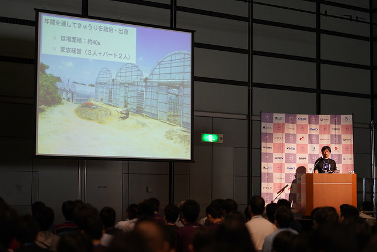
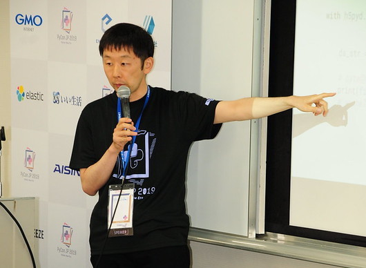
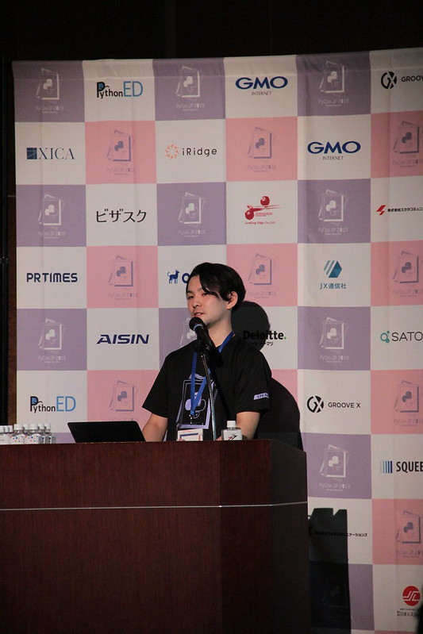
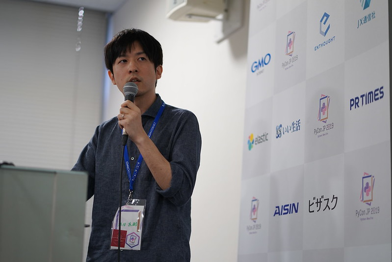
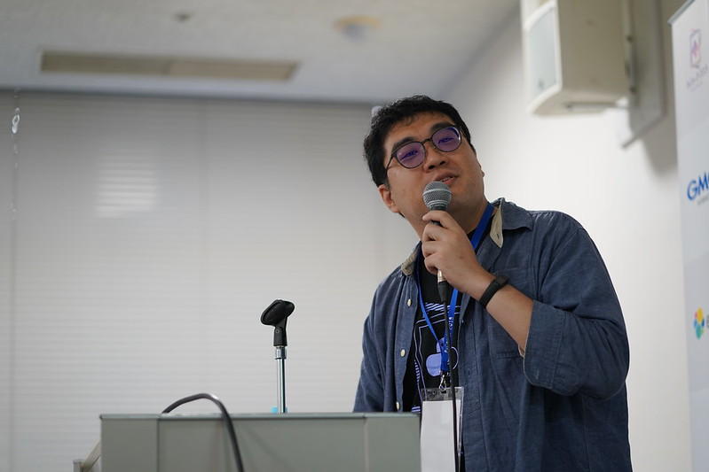
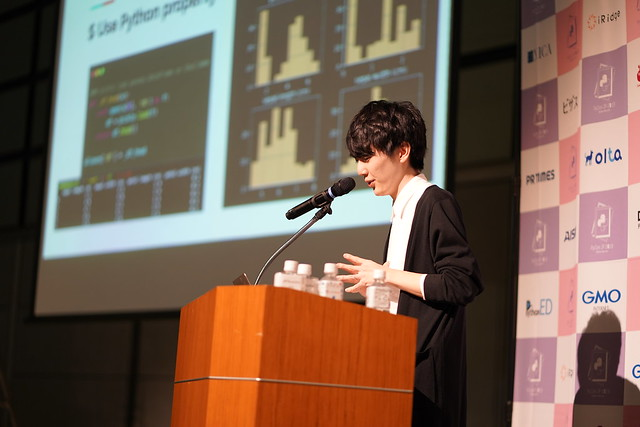
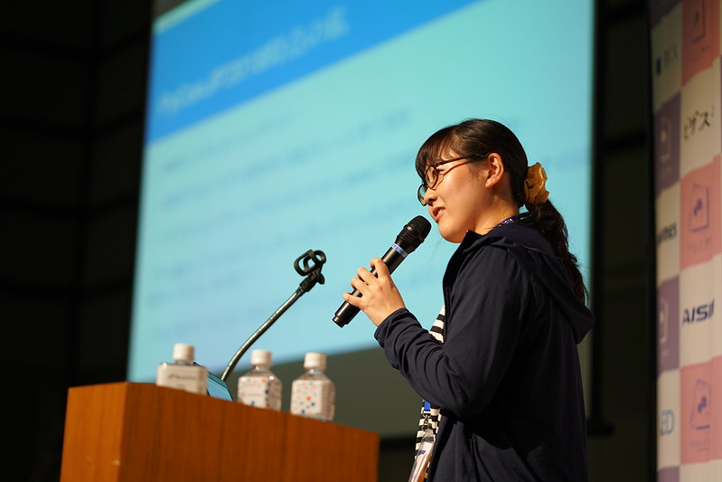

先日公開したPyCon JP 2019 1日目のカンファレンスレポートはいかがでしたでしょうか？ 本レポートでは引き続き、2日目の基調講演やカンファレンスなどの様子をご紹介します。

PyCon JPは、Pythonユーザが集まり、PythonやPythonを使ったソフトウェアについての情報を交換し、Pythonユーザが交流をするためのカンファレンスです。PyCon JP 2019は2019年9月14日にHENNGE株式会社で行われたスプリントから始まり、9月15日チュートリアルと9月16日〜17日のカンファレンスを大田区産業プラザPiOで行いました。

今年のテーマの「Python New Era」には日本の元号が平成から令和に変わり、Pythonも2から3へ新しく時代が移っていくコンセプトが込められています。今年も素晴らしいセッションが多数発表されましたので、その中からピックアップして紹介します。各講演・セッションの紹介の最後に、動画やスライドのリンクも紹介してあるので、当日参加した方もできなかった方も、気になったものをさらにチェックしてみてください。

# 2日目基調講演「Pythonで切り開く新しい農業」 ー 小池 誠

（nikkie）

2日目は、きゅうりの自動選別機の開発で有名な小池誠氏による基調講演から始まりました。

これまでの作品を紹介してから、「Pythonでなにか作って楽しむ人」と自己紹介した小池氏は

- Makerのコミュニティに広がるPython
- Pythonではじめる新しい農業

という2つのトピックについて話しました。

内容をもう少し詳しく紹介していきます。

オープンソースのソフトウェアには、ソースコードを見て、触発されてソフトウェアを書くという文化があります。
これがハードウェアに広がったことがMaker movementの本質であると小池氏は説明しました。
小池氏が今年MakerFaireに出展した「草取り自動運転ロボット」も[donkeycar](https://github.com/autorope/donkeycar)をベースにしているそうで、触発されたモノづくりの一例だと思います。

そんな**MakerのモノづくりにPythonが広がっている**そうです。
小池氏はその理由を共有しました。
1つ目は、「ロボットに高度な認知行動をさせたい」ために、Pythonを選択してディープラーニングに取り組むこと。
2つ目は、Pythonやmicropythonをサポートしたハードウェアが整ってきたこと（Raspberry PiやJetson Nanoなど多くのデバイスが紹介されました）。
3つ目は、Pythonは読みやすく書きやすいため、ラピッドプロトタイピングに向いていることです。
実際、小池氏の作品を見ると、短い周期で発表されている上に、Pythonで組み込み開発やディープラーニング、Webアプリと広範な領域を扱っています。
この3つの理由には納得ですね。

「Pythonでなにか作って楽しむ」小池氏は、農業にPythonを持ち込みます。
小池氏の家はきゅうり農家を営んでいます。
きゅうりをはじめとする果菜類は米やキャベツなどに比べて労働時間がかかります。
収穫作業、選別を含む出荷作業、苗の世話をする管理作業など、手作業が多く、機械化が難しいと言われます。
このうちの**出荷作業の自動化**に小池氏は取り組みました。
出荷作業に時間をかけてもきゅうりの品質は上がらず、収量も増えないため、出荷作業時間を短縮して管理作業の時間を増やしたいというモチベーションからです。

画像認識分野におけるディープラーニングの目覚ましい成果に注目した小池氏は、きゅうりの画像を2475枚用意して9つのクラスに分類する試作1号機を2016年に製作します。
きゅうりの画像データ収集期間が短く、データに偏りがあったためたまたまとのことですが、正答率は80%でした。

正答率を上げることを考えた小池氏は、人が選別するときに様々な方向からきゅうりを見ることに着想を得ます。
そして上・横・下の3方向からきゅうりを撮影してデータを集めます。
きゅうり8500本分の画像を集め、分類モデルを作ったところ、正答率は91.6%でした。
そこで、ベルトコンベアを自作して、選別を自動化する2号機を完成させます。
熟練者に見てもらうと、2号機の分類精度はまあまあでしたが、「ベルトコンベアの移動できゅうりのイボがとれてしまう」「選別が遅い」という欠点も分かりました。

ここで小池氏は方針を転換します。
2号機まではAIで出荷作業を自動化することを考えていましたが、**AIのサポートで人間の作業を効率化する**ことにしたのです。
3号機は、実用を考え、カメラの台数を1台に減らし、選別スピードを上げるためにカメラの解像度を落としました。
そのため、きゅうりの画像と長さ・表面積・太さのデータから学習させたモデルの正答率は79.4%とこれまでより落ちました。
しかしながら、実作業で半年間稼働させ、初心者が選別する場合より1.4倍スピードアップするという結果が出たそうです。
きゅうりの太さが季節ごとに変わるため、モデルに入力する長さなどのデータをキャリブレーションするというのは、農作物を扱う場面ならではのノウハウだと思いました。

3号機を利用する中で、小池氏自身がきゅうりの選別ができるようになったそうです。
これは、**熟練者のノウハウがAIで再現され、AIから小池氏が学んだ**ということで、農業のノウハウの継承の可能性と評価していました。
現在小池氏は博士課程の学生として、農作物の品質を上げる研究や、農作物のデータ分析に携わっているそうです。
「未来には農業のノウハウも`pip install`のように簡単にインストールできるようにしたい」と語る小池氏が印象的でした。

最後のまとめで「I don't learn for start something new, I try to start something new to learn.（何かを始めるために学ぶのではなく、**学ぶために何かを始める**）」という小池氏のマインドセットの共有がありました。
全ては学ぶためと考えると、失敗はなくなるそうです（この点には私自身、非常に共感しました！）。
たしかに、小池氏はきゅうりの選別機の製作においても、試作機をアウトプットし、やってみてわかったことをインプットして、次のアウトプット（試作機）につなげています。
New Eraということで「Python3で新しいこと始めてみませんか？」と結ぶ、PyCon JP 2019にふさわしいキーノートでした！



### 資料リンク

* [動画](https://www.youtube.com/watch?v=0bTPOsVvG7g&t=1380)
* [スライド](https://www.slideshare.net/ikemkt/pyconjp2019python)

# 2日目注目セッション「知ろう！使おう！HDF5ファイル！」 ー thinkAmi

（nikkie）

thinkAmi氏による「知ろう！使おう！HDF5ファイル！」をレポートします。
​
株式会社日本システム技研（所在：長野市）所属のthinkAmi氏は、ブログ「[メモ的な思考的な](https://thinkami.hatenablog.com/)」やDjango Congress JP 2018、2019の登壇などで精力的にアウトプットされています。
今回はHDF5ファイルについてのトークでした。
HDF5ファイルは、例えばKerasを使った機械学習で、モデルの保存に使われますね。
（ちなみに、thinkAmi氏の他にも日本システム技研のメンバーが[IoT](https://www.youtube.com/watch?v=ZMjNAay-goQ)や[ライブコーディング](https://www.youtube.com/watch?v=lCQWLAJf6xQ)と多彩な発表でPyCon JPを盛り上げています！）

最初のパート「知ろう！」は、HDF5ファイルは初めてという方向けの導入でした。
HDFはHierarchical Data Formatの略で、**階層構造を持ったデータフォーマット**を指します。
エクスプローラーやFinderであるディレクトリの下のディレクトリツリーを見ることができますが、HDF5ファイルは、そのディレクトリツリーをまるごとファイルにしたものと理解しました。
5というのは現在のバージョンで、過去には4というバージョンもあったそうです。
HDF5ファイルは、次の3つの要素から構成されます。

- データそのもので、ファイルに相当する「Dataset」
- Datasetを入れるもので、ディレクトリに相当する「Group」
- DatasetやGroupの注釈となる「Attribute」

HDF5ファイルの特徴の一つは、クロスプラットフォームで使えることだそうです。

HDF5ファイルを見るためのツールを紹介した後、「使おう！」ということで、いよいよPythonからHDF5ファイルを操作します。
サードパーティモジュール`h5py`または`PyTables`で操作できるそうです。
画像やExcelファイルを読み込んで、`create_dataset`メソッドでGroupに保存したり、
HDFファイルに含まれるDatasetを`visititems`メソッドで検索してから目的のDatasetを開いたりといった操作の紹介がありました。
HDF5ファイルはローカルに保存するだけではなく、REST APIを介してHDF5ファイルを共有できるサーバ（h5serv）や、
サーバの機能をクラウドで使うためのサービス（HSDS）も提供されているそうです。

最後にHDF5ファイルのバージョンについての共有です。
現在は1.8系と1.10系があり、1.8系は2020年5月でパッチリリース終了、また、1.10.2以前と1.10.3以降とでは互換性がないそうです。
このトークを機に触ってみようという方にとってありがたい情報ですね。

機械学習で登場するHDF5ファイルが一体何物なのか、このトークを聞いてわかりました。
機械学習で使っているHDF5ファイルを覗いてみると、このトークで効いたことの理解を深められそうです。



### 資料リンク

* [動画](https://www.youtube.com/watch?v=bSdRlfC2yqA)
* [スライド](https://speakerdeck.com/thinkami/pycon-jp-2019-talk)
* [プレゼン用GitHubリポジトリ](https://github.com/thinkAmi/PyCon_JP_2019_talk)

# Pythonでライブをしよう -FoxDotを使った新時代のPython活用法- - 田中 慎太郎

(横山直敬)

株式会社日本システム技研所属の田中 慎太郎氏による発表です。

FoxDotとは、音響合成用プログラミング環境・言語のSuperColliderをPythonから操作するためのライブラリです。
SuperColliderを用いるとリアルタイムに音響を合成することができます。SuperCollider自体は独自のプログラミング言語ですが、
FoxDotによりインタラクティブシェルやJupyter NotebookからPythonの文法でSuperColliderの機能を使うことができます。



音楽や映像をインタラクティブに生成するパフォーマンスを「ライブコーディング」と呼びます。「ライブコーディング」の特徴は偶然性と即興性のあるアルゴリズミックなアプローチができることです。
田中氏はDTMを趣味にしており「ライブコーディング」の存在自体は知っていましたが、当初はプログラミングする必要性に疑問を持っていたそうです。しかし「[そのDJたちは「コード」で踊らせる──人間と機械が“共創”するアルゴレイヴの世界](https://wired.jp/2019/05/19/algoraves-live-coding-djs/)」という記事に触発されてライブコーディングを始めました。

FoxDotで使える音色は大きく分けて3種類です。

1. play: ドラム音源。文字ごとに別々の音源が割り当てられている

2. loop: 自前で用意した音声ファイルのループ。

3. それ以外: シンセサイザーのような音

FoxDotではPlayerObjectと呼ばれるオブジェクトで音色とその設定であるSynthDefsを操作します。SynthDefsでは属性を編集することで音色や音高、長さを変更できます。
SynthDefsの中では繰り返し表現をしたり時間による変化をつけることができます。
繰り返し表現はPatternObjectを使い、listの先頭にPをつけて表します。PatternObjectを使うことで冗長なコードを避けることができます。
時間による変化はTimeDependentVariablesを使います。実行ごとに結果を変えることができます。


以下に示すのがFoxDotのコード例です。普段、目にしているPythonの文法とは大きく異なっています。PlayerObjectへのSynthDefsの割り当てにはシフト演算子が使われていますし、PatternObjectはlistが元になっています。
この通常のPythonと異なる振る舞いはPythonのオブジェクトが持つ特殊メソッドを使って、元の振る舞いを上書きすることが実現していると説明していました。

```python
d1 >> play("X-O-")
p1 >> pluck([0, 1, 2, 3, 4, 3, 2, 1], dur=1/2, amp=1.5) 
p2 >> pluck(P[[0, 1, 2, 3, 4])
```

Pythonは主にWeb開発やデータ分析で活躍していますが、これからはそこにライブコーディングも加わっていきそうです。
トークセッションでは実際に田中氏がFoxDotを使ったライブコーディングを行う一幕もありました。実際にどのようなパフォーマンスができるのか気になる方はぜひ動画もチェックしてみてください。

### 資料リンク

* [動画](https://www.youtube.com/watch?v=lCQWLAJf6xQ)
* [スライド](https://speakerdeck.com/sin_tanaka_21/pyconjp-2019)

# 2日目注目セッション「新米Pythonistaが贈るAirflow入門 & 活用事例紹介」ー松田直樹

（平尾 元紀）

松田直樹氏による「新米Pythonistaが贈るAirflow入門 & 活用事例紹介」の発表です。
Airflowとは元Airbnb製のPythonで作られたオープンソースで、バッチ処理からなるワークフローのスケジューリング＆モニタリングが可能なプラットフォームです。現在はApacheソフトウェア財団が管理、開発を活発に行なっています。
AirflowではPythonコードでワークフローをDAG（Directed acyclic graph, 有向非巡回グラフとも）表現します。
これによりワークフローを構成するタスクを作成し、処理を実行していきます。

発表では、社内での活用事例を取り上げていました。社内向けのデジタル広告プランニングツールを開発するプロダクトに携わっているそうですが、その中の課題としてデータがRDBに入っていないものがあり必要なデータをたどるのが大変であるという課題がありました。そこで、データマートを作成することで、開発プロダクト用に必要なデータを作成する方法についてお話されていました。
AWS Fargateを使い、その内部でAirflowを使ってカラム名を寄せるなどの処理を実現し、活用可能なデータの取り出しを実現していました。
実現する上でハマったポイントの共有もありました。タスク間のデータのやり取りと、Dockerを用いたローカル開発環境の構築についてお話されていました。

エンジニア業務に入って9月で1年とのことでしたが、AirflowとAWSのサービスを組み合わせ、開発をより円滑にするための業務改善に生かしている点が素晴らしいと思いました。
タスクをワークフローで処理できるAirflow、自分もデータ処理で困っているときがたまにあるので、今一度今回の発表を聞き直して活用していきたいです。



### 資料リンク

* [動画](https://www.youtube.com/watch?v=T0JVQWfnRAo)
* [スライド](https://speakerdeck.com/matsudan/pycon-jp-2019-xin-mi-pythonistagazeng-ruairflowru-men-and-huo-yong-shi-li-shao-jie)

# 2日目注目セッション「Ansibleを通じて「べき等性」を理解してみよう」ーKazuya Takei

（平尾 元紀）

Kazuya Takei氏による「Ansibleを通じて「べき等性」を理解してみよう」の発表です。
冪等性とはざっくりいうとある操作を何度実行しても、同じ結果になる性質を持つことを意味します。
AnsibleはPython製の構成管理ツールで、主にサーバーのセットアップなどに用いられます。Ansibleでは「動作」でなく「状態」を定義して使用する特徴があります。この理由を設定ファイル内のPlaybookを見ながら説明をなされていました。
同じPlaybookを実行しても2回目以降は状態に変化がないことから、ある操作を何度実行しても同じ結果になるので、
Ansibleは定義された「状態に対する冪等性」を担保されるようになっています。

発表の後半では実際のAnsibleのコードを読みながら、Ansibleが実現している冪等性についてお話されていました。
pip コマンド経由で、Pythonパッケージの状態を管理するpipモジュールを例として取り上げていました。
コードの内部では、求める状態に応じて、地道にコマンドを生成していました。実行結果（リターンコード、標準出力、標準エラー）を見ながら、状態に変化があったかどうかを判定していました。

Ansibleが実現している冪等性について理解するとともに、発表で取り上げられていたコード断片を見ていると、Ansibleの内部ではリターンコードの値を見ながら処理したりしていて、人気のあるライブラリも中では地道に作られているのだなということを知る良い機会となりました。
これを機に、人気のOSSのコードをもう少し読んで、中で何を実現しているのかを理解したいと思いました。



### 資料リンク

* [動画](https://www.youtube.com/watch?v=Em1xC5bIGl0)
* [スライド](https://attakei.net/slides/pyconjp-2019/index.html)

# 2日目ライトニングトーク

1日目と同様に、2日目のクロージングでも7枠のライトニングトークがありました。ここではその中から2つのライトニングトークを紹介します。

## 「Python製シェルXonshの紹介」 ー Shunsuke Kawai

（nikkie）

日本人で一番Xonsh（コンシュ）にコントリビュートしていると自負するKawai氏によるXonshの紹介ライトニングトークです。

Xonshとは、**Pythonとシェルスクリプトを扱えるシェル環境**です。
`pip install xonsh`で導入できます。
書き慣れたPythonの構文やモジュールを使ってシェルを扱えるため、敷居が低いシェルという紹介でした。

Pythonの構文でシェルのコマンドを作れる例として、

- `pickle`で保存した`pandas`のDataFrameを整形してシェル上に表示する
- `matplotlib`で描画したグラフをシェル上に表示する

が紹介されました。
**コマンドとしてまとめられる**のは`ipython`より便利かもと感じました。Xonsh試してみたいです。




## PyConJP2018で勇気をもらってPythonエンジニアになった話 - Mizuki Sato

(横山直敬)

2日目の当日LT、Mizuki Sato氏による「PyConJP2018で勇気をもらってPythonエンジニアになった話」を紹介します。

現在、Mizuki氏はDjangoやVue.jsを使ってWeb開発をするPythonエンジニアとして働いています。
去年のPyCon JP 2018の時点では、HR系システムのヘルプデスクで働いていました。
手を動かしてものづくりをしたいと思って入社したMizuki氏は、少しSQLを書いたりトラブルシューティングのためにJavaやCOBOLのソースコードを読むくらいしか技術的なことができない環境に悩みながらもプログラミングの独学を続けていました。

独学していてもどこか自信が持てなかったMizuki氏は、初めて参加したPyCon JPで似たような境遇にあった@__yumechi氏のLT「PyCon JPで転職してみた人のホンネ」を聴いて「自分にでもできるかも」と思えるようになりました。
そこから、Pythonエンジニアになるという目標を立て、「DjangoでWebアプリケーションを作って公開する」「ブログに学習記録を書く」という2つのことに挑戦し始めました。そして、その結果としてPythonエンジニアになることができ、さらに今ではDjango Girlsでプログラミング初学者にプログラミングを教える活動も行っています。


最後にMizuki氏は、2018年の自分のような境遇にいる人に対して、自分の経験を見て「できるかも」と感じてほしいというメッセージを伝えて発表を終えました。

「今年はPythonエンジニアとしてここに立っています！」という言葉に胸を熱くした参加者の方は多いのではないでしょうか。私もその一人で、PyCon JPはカンファレンスを通じて知識や技術を共有する場所というだけでなく、Mizuki氏や@__yumechi氏のように自分のキャリアを大きく変えるチャンスがある場所でもあることを強く認識することができました。



## 2日目ライトニングトーク一覧

今回ご紹介しきれなかったものも含め、2日目のライトニングトークの一覧はこちらです。また、PyCon JPの公式アカウントに[ライトニングトークの動画](https://www.youtube.com/watch?v=UShlTE8wdzU)がアップロードされています。

査読付きLT

- Shunsuke Kawai / Python製シェルXonshの紹介
- 長谷川大耀 / pythonで、処理をより効率化するためのTips集
- Huang Kunxian / Python in the Belle II experiment

当日LT

- PyCon 2019 NOC Team / 1000人のっても大丈夫!!なWi-Fiを建てるお仕事
- Mizuki Sato / PyConJP2018で勇気をもらってPythonエンジニアになった話
- nikkie / PyCon JP スタッフをして思うこと
- IOSIF TAKAKURA / ZAPPA悲哀物語

# クロージング

（平尾 元紀）

まず座長の吉田さんから今年の来場者数の発表がありました。9/14のスプリントには103名、9/15のチュートリアルには106名、9/16, 17のカンファレンスには951名が参加し、トータルで1160名の参加者となり、今年も1000人を超える大きなイベントとなりました。

続いて、一般社団法人 PyCon JPからの報告がありました。
最初に、商標権のお話がありました。「Python」を商標登録している会社に対し、米Pythonソフトウエア財団（PSF）として行動するとのことでした。

次に、2019年は4つのPythonカンファレンスと10回のPython Boot Campに支援したという報告がありました。また新しい試みとしてOSCにPython Caravanとして参加することや、PyLadies、Python Boot Campの参加者に援助も始めたとのことです。
PyCon JPでも金銭的なサポートや運営の相談に乗ってもらっており、一般社団法人 PyCon JPはコミュニティを支える、なくてはならない存在となっています。

セッションの裏側ではコミュニティーのミートアップも行われ、盛況だったとのことです。東京のPyCon JPだけではなく、ぜひタイミングがありましたら地方のPyConにも参加してみてください。

最後に、来年のPyCon JPの日程が8/28(金), 8/29(土)と発表されました。場所は2019年と一緒の大田区産業プラザPioです。座長はまだ未定です。クロージングでは3年間座長を務めた吉田さんへ花束が贈呈されました。
来年のPyCon JPも楽しみですね。

