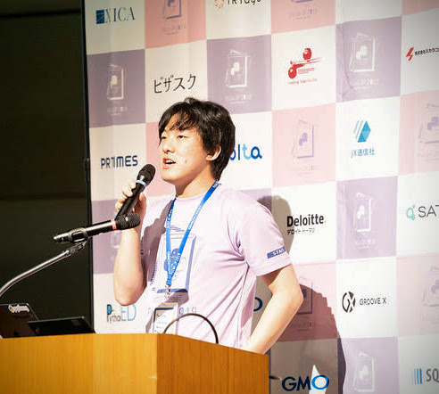

# 横山 直敬

コンテンツチームでレビューとポスターセッション(コミュニティ)及びオープニング・クロージングとLTの司会進行を担当。

PyCon JP 2017から3年間スタッフとして参加している。

また、毎月開催されている「[みんなのPython勉強会](https://startpython.connpass.com/)」に企画スタッフとして関わり、登壇者の推薦や企画の主催を行っている。

普段は[株式会社ビープラウド](https://www.beproud.jp/)でPythonエンジニアとして受託開発のプロジェクトに参加する他、オンラインPython学習プラットフォーム[PyQ](https://pyq.jp/)の問題作成にも携わっている。

Twitter:[@NaoY_py](https://twitter.com/NaoY_py)