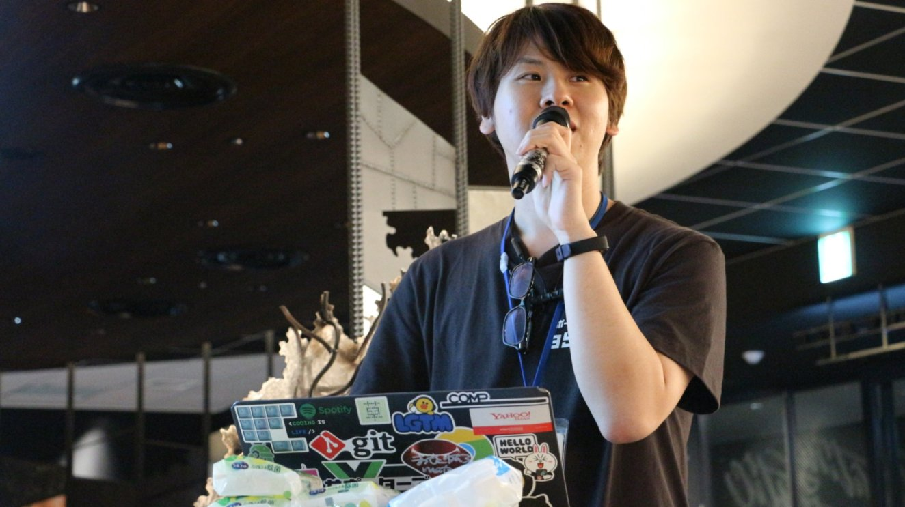

# 牛窪翔（うしくぼしょう）

事務局チームでメディアスポンサーを主に担当。PyCon JPにはPyCon JP 2019で初めてスタッフとして参加。
Pythonに関しては、大学院にて機械学習、社会人にてDjangoでのシステム開発経験があり、プログラミング言語の中で一番好き。
前職はAndroidアプリエンジニア、現在は[株式会社サポーターズ](https://corp.supporterz.jp/)にてエンジニア専門の中途エージェントとして転職支援やキャリア相談をしている。また、自社勉強会プラットフォームの[サポーターズCoLab](https://supporterzcolab.com/)でマネージャーとして勉強会やハッカソンの企画・運営・自身の登壇を行っている。

ポートフォリオ: [Ussy's portfolio](https://sudo5in5k.github.io/portfolio/)

Twitter: [@shoushi12](https://twitter.com/shoushi12)