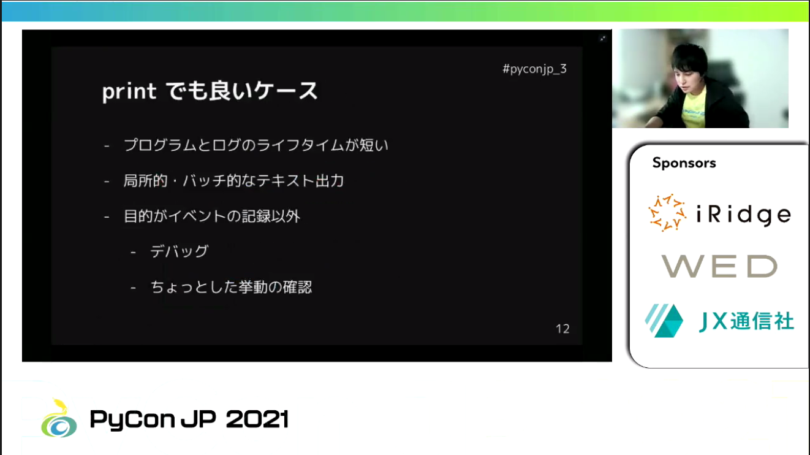

## セッション 「Loggingモジュールではじめるログ出力入門」 ー 堤 利史

（神田 佳積）

堤 利史氏による「[Loggingモジュールではじめるログ出力入門](https://2021.pycon.jp/time-table/?id=272259)」のセッションを紹介します。

堤氏はGMOペパポ株式会社にてデータエンジニアとしてデータ基盤の構築・運用に従事しております。

このセッションではPythonに標準搭載しているloggingモジュールの利用判断基準、構成要素、ならびに、ログ出力方法と実装例に関して取り上げられました。(対象バージョンは3.9)

最初にloggingモジュールの利用判断基準としてprint関数でも良いケースについて説明がありました。
確かにデバッグなり軽い挙動確認等ライフタイムが短く、イベント記録以外の場合はprint関数でも良さげという感じがしました。
また便利ポイントとして説明されたイベント時刻・発生箇所の記録、エラーや警告等ログレベル指定が必要となる場合はloggingモジュールを用いた方が適切という感じがしました。

続いてloggingモジュールの主な構成要素として

1. Logger
1. Level
1. LogRecord
1. Filter
1. Handler
1. Formatter

が存在し、各々の要素についての説明がありました。
無意識にHandler、Formatter以外のLoggingモジュールの構成要素を使用していることが多いのですが、ログ出力ではファイルに対しても書き出すことがあるのでHandlerやFormatterも意識したログ出力をすると良さそうです。
またLoggingモジュールの性質で階層構造についての説明があり、読み込まれた時点でroot logger(全てのLoggerの祖先)が生成されるというのが印象的でした。よく参考書等で直接記録するサンプルコードを見かけますが、これらはroot loggerで行っているものだと改めて認識させられました。ちなみにpropagate属性を用いれば上位のLoggerに伝播できるとのことです。

ログ出力方法としてアプリケーション、ライブラリ各々のお作法、AWSならびにGCPでの出力の仕方について説明がありました。
アプリケーションでの設定では以下設定方法について説明がありました。

1. コードで直接指定
1. logging.basicCongfig
1. logging.config.dictConfig

またライブラリでは詳細設定を行わず、NullHandlerのみは設定して問題ないとのことでした。

アプリケーションの設定ですと簡単なものでしたらコードで直接指定、クラス構造がはっきりしているものはlogging.config.dictConfigで行った方が最善ではないかなと説明を聞いていて感じました。

AWSならびにGCPでの出力の仕方については、Twelve-Factor Appを前提としてAWSではLambda及びAWS Glue Python Shellジョブタイプを用いたCloudWatch Logsへの出力、GCPではCloud Functions及びCloud Runを用いたCloud Loggingへの出力のプログラム例について説明がありました。
詳細は割愛しますが、実際にGitHubに[ソースコード](https://github.com/tosh2230/pycon-jp-2021)があるとのことですので、実際に手を動かしてみるのも良いかと思います。

筆者(神田)自身ここ最近Pythonを触り出した者としてLoggingモジュールが標準で用意されていることは知っているものの、構成要素等詳細なところまではわからないところがありました。このセッションでどういう構成要素がどんな動きをするかが理解出来、設定方法のバリエーションやパブリッククラウドでの利用例等も聞けて有意義でした。

Pythonを用いたシステム開発を行っている方に加えて、これから開発に関わる初学者の方にもお勧めしたいセッションでした。
