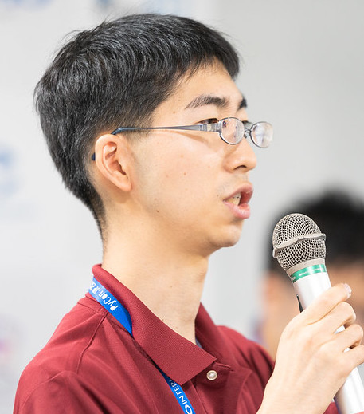

# nikkie（にっきー）

2019年よりPyCon JPスタッフ活動を始め、2021年は座長としてがんばりました。

株式会社ユーザベース所属のデータサイエンティスト。
PyCon JPスタッフの他に、毎月開かれる「みんなのPython勉強会」のスタッフもしている。

特にスタッフ活動で退屈と感じたことをPythonにやらせ、それをネタにしたアウトプット（勉強会でLT、PyCon登壇）多数。
アニメも好きで、解放された現在は『アイの歌声を聴かせて』という作品をPythonの力を借りて応援している。

Twitter: [@ftnext](https://twitter.com/ftnext)
