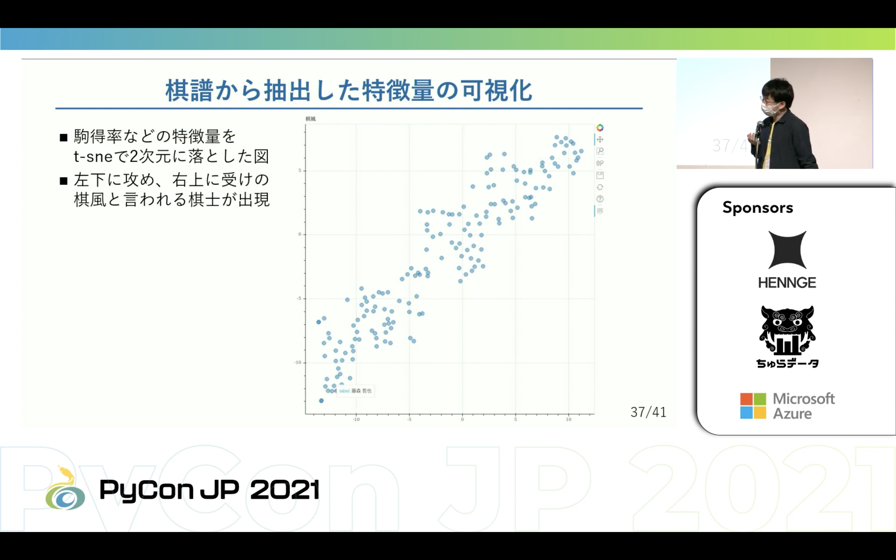

基調講演: 将棋とPythonの素敵な出会い
---
1日目のキーノートセッションは、谷合 廣紀氏が登壇しました。谷合氏はプロの棋士であると同時にPythonistaであり、「[pythonで理解する統計解析の基礎](https://gihyo.jp/book/2018/978-4-297-10049-0)」という書籍も執筆されています。

発表ではまず「棋士とAIの関係」について語られました。「チェスは人工知能のショウジョウバエ」と言われているほど歴史的に人工知能はチェスを題材として進化しきた言われる部分が大きく、日本では将棋を題材に進化していき、近年では電王戦が代表的に棋士とAIが戦うといったイベントも開かれました。結果、事実上プロ棋士に勝利し今後棋士としての仕事はあるのかという心配もありましたが、現在ではライブ放送で棋譜を予想し勝率をリアルタイムを計測したり、AIの評価を参考にして棋士の研究パートナーとして共存しています。
谷合氏は棋譜の将棋AIとして大きく2つにわかれていると説明します。

- αβ法系
  - これまでの主流でCPUを活用し読みの速度が高速
  - 探索局面を大量に生やすことで評価精度を上げている
- DL系
  - ここ数年で発展が目覚ましく、GPUを活用する関係でマシンパワーが必要
  - 方策ネットワークを使用しゲーム木を探索をしていく

αβ法ではC＋＋などで高速化しているのに対してDL系はモデル部分はCNNを用いているためPythonで書くことができます。DL系では盤面全体を9×9×Cとしていてみており、王金銀など周囲一つしか移動できない駒の場合は良いが飛角香といった飛び駒と呼ばれる2つ以上移動できるコマの場合は3×3Convの範囲外になってしまい全体としての特徴を掴みづらいという点を加味し、Transformerを用いれば特徴量を単層して捉えるのでは？と疑問を持っていました。先駆者は少なかったため自分で作ってみようということで[BERT-MCTS](https://github.com/nyoki-mtl/bert-mcts-youtube) というBERTとMCTSを組み合わせたAIを新たに作成し、将棋に造詣があるyoutuberと対戦した動画を公開されています。
BERTはGoogleが開発した自然言語処理モデルで盤面を文字列として変換し、探索部分をチェスや将棋などで用いられることが多いMCTSを使用しています。BERTに代表される自然言語処理モデルは事前学習が大事だと一般的に言われており、BERTではMaskedLanguageModelという大規模事前学習を可能にする手法が使用されています。教師学習なしで事前学習が可能ということを期待し、実際にBERT-MCTSにも取り入れたものの、現在将棋AIの世界では強い棋士の棋譜や強いAIの棋譜など良質な教師データがたくさんあり、今回はこの事前学習はそこまでメリットを感じないと説明しつつ、教師データが少ない場合では有用であるとも述べていました。
youtubeで使用したBERT-MCTSは2・3日で作成できたと言い、短時間で作成できた要因として書き慣れたPythonであること・Pythonには機械学習に対応したライブラリが豊富であるあることを挙げています。
他にも、将棋にAttention層を使うことで盤面において上級者がどこに注力しているかの可視化を行ったり、棋譜から特徴量を抽出して可視化した際に「棋風」というものが存在した話などここでは書ききれないコアな話をエンジニア・棋士の両側面から話されました。

最後にまとめとして「棋士×エンジニア」という自身の経験から、将棋界とITを知っているからこそ解決できる問題が認識でき、それを自分で作れるということが一番の強みとし、今後はPyConJPでの発表をはじめ「棋士×何か」という将棋界以外のものが増えてくるのではないかと予想しました。
そして今後の将棋とITの今後に関しては、将棋自体はAIが超えてはいるもののまだまだ手動で行う作業も多く、様々な改善の余地があり、DL系の台頭によりそれまでC＋＋でしかかけなかった将棋AIがPythonで書けるようになったことで敷居が下がり、他の機械学習モデルをPythonで勉強していたエンジニアも参入しやすくなったとまとめています。
より詳細な使用ライブラリや棋風とは何か気になった方は[こちらから動画アーカイブや発表資料](https://2021.pycon.jp/time-table/?id=290208)を御覧ください。
