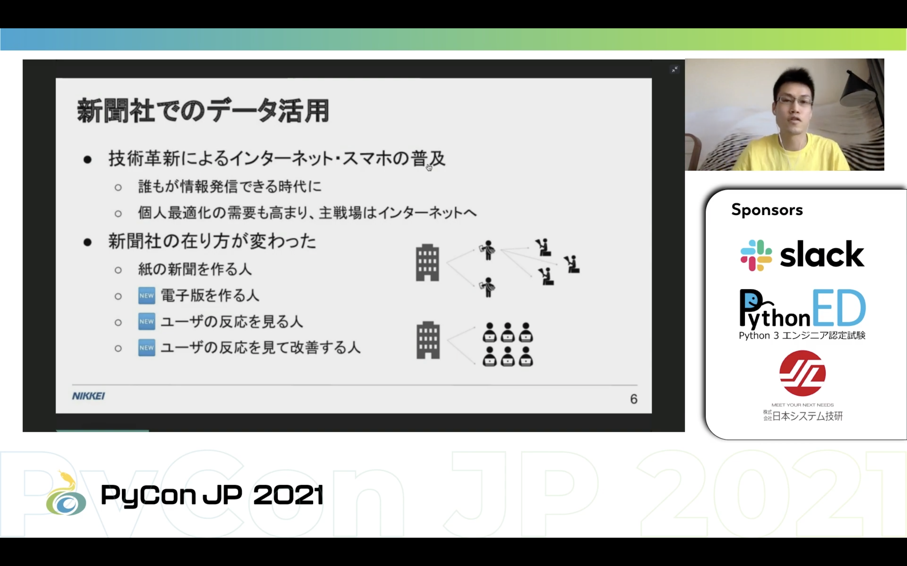

Pythonによるアクセスログ解析入門
---

石原氏は株式会社日本経済新聞社所属し上級研究員としてデータ分析・サービス開発に従事しておりKaggle Masterや書籍を執筆している他、INMAが選出する30 Under 30 Awardsにてアジア太平洋部門の最優秀賞を受賞しています。
本発表ではPythonでアクセスログを解析する手法及びそれらを用いたレコメンドなどの活用事例を紹介しています。

新聞社のあり方として紙から電子版に移行しており、公開した記事の反応やレコメンド等においてアクセスログが重要となっています。そして実際にアクセスログを解析しデータ分析という文脈に落とし込むのがデータサイエンティストの仕事となっています。
では、Pythonを利用するところはどこかというとデータを処理するところで、データを取得後にリアルタイムで可視化・集計しながら探索したい場合やデータを取得後に高度な処理が必要な場合は現状ではまだSQLだけでは難しくPythonを使って加工をしています。
また実際の処理の仕方として、株式会社Gunosyが公開しているデータセットを利用しデータセットの読み込みから記事単位での集計や記事推薦など、pandasを用いたサンプルコードが[Googlecolab上に提供されています](https://colab.research.google.com/drive/1r4GcXWvM-j-dlfT0XF-O-Y5DiyAM-gGq?usp=sharing)。

他にもKaggleへの出題や年齢推定など応用例もあがっていますので気になる方は[こちらから動画アーカイブや発表資料](https://2021.pycon.jp/time-table/?id=269506)を御覧ください。
